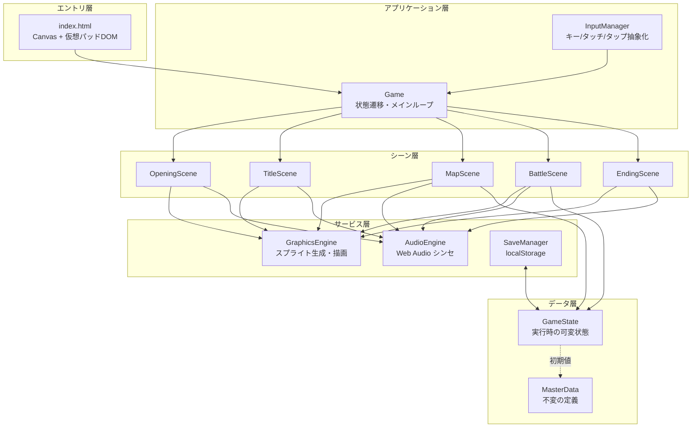

# 『妖幻奇譚 〜もののけ草子〜』技術設計書 v1.0

**作成日**: 2026-08-31
**作成**: Claude Code
**目的**: 別端末でゼロから再実装するための**アーキテクチャ・実装方式の設計指針**
**対**: `SPEC_要件仕様書.md`（作るものの定義はそちらを参照）

> 本書は「どう作るか（HOW）」を定義する。現行実装をそのまま写経するのではなく、
> レビューで判明した構造的欠陥（仕様書 §12）を**設計段階で解消した形**で記述している。
> 「現行」と書かれた箇所は既存コードの実装、「推奨」は再実装で採用すべき方式を指す。

---

## 1. 全体アーキテクチャ

### 1.1 レイヤ構成



### 1.2 現行との最大の違い: データ層の分離

**現行の問題**: `GAME_DATA` が「マスターデータ（不変の定義）」と「実行時状態（Lv・HP・所持数）」を兼ねている。このため:
- 「はじめから」で初期化できない（初期値がどこにも残っていない）
- 現行は `resetToInitial()` の中に**初期値をもう一度ハードコードで書き写す**という対処になっており、データが二重管理になっている

**推奨設計**: 完全に分離する。

```js
// masterdata.js — 不変。ゲーム中に一切書き換えない
const MASTER = Object.freeze({
  characters: [...],   // 初期ステータス定義
  skills: {...},
  items: [...],        // 初期所持数を含む定義
  enemies: {...},
  encounters: {...},
  npcs: [...],
  bossEvents: {...},
  chapters: [...]      // 章定義（マップ生成関数・開始座標・セーブ点など）
});

// gamestate.js — 可変。セーブ/ロード/リセットの対象はこれだけ
class GameState {
  constructor() { this.reset(); }

  reset() {
    this.party = MASTER.characters.map(c => structuredClone(c));
    this.items = MASTER.items.map(i => structuredClone(i));
    this.money = 0;
    this.chapter = 1;
    this.bossDefeated = {};
    this.artifacts = { mirror: false, magatama: false, sword: false };
    this.player = { gridX: 12, gridY: 14, facing: 'down' };
  }

  toJSON()      { /* セーブ用のプレーンオブジェクトを返す */ }
  loadJSON(o)   { /* 検証しつつ復元 */ }
}
```

これにより「はじめから」は `state.reset()` の1行、セーブは `state.toJSON()` の1行になり、初期値の二重管理が消える。

---

## 2. クラス設計

### 2.1 Game（オーケストレータ）

```js
class Game {
  constructor(canvas) {
    this.ctx      = canvas.getContext('2d');
    this.ctx.imageSmoothingEnabled = false;

    this.state    = new GameState();
    this.graphics = new GraphicsEngine();   // 起動時に全スプライト生成
    this.audio    = new AudioEngine();
    this.input    = new InputManager(canvas, () => this.audio.unlock());

    this.scenes = {
      OPENING: new OpeningScene(this),
      TITLE:   new TitleScene(this),
      MAP:     new MapScene(this),
      BATTLE:  new BattleScene(this),
      ENDING:  new EndingScene(this)
    };
    this.current = null;
    this.frame   = 0;
  }

  changeScene(name, params) {
    this.current?.exit?.();
    this.current = this.scenes[name];
    this.current.enter(params);
  }

  start() {
    this.changeScene('OPENING');
    const loop = () => {
      this.frame++;
      this.current.update(this.input, this.frame);
      this.ctx.clearRect(0, 0, 1280, 960);
      this.current.render(this.ctx, this.frame);
      this.input.endFrame();        // justPressed のクリア
      requestAnimationFrame(loop);
    };
    requestAnimationFrame(loop);
  }
}
```

**現行との違い**: 現行は `Game` が状態遷移・タイトル画面描画・戦闘開始・エンカウント抽選・蘇生処理まで抱えており、`main.js` が肥大化している。シーンを共通インターフェース（`enter/exit/update/render/handleTap`）に揃え、`Game` は交通整理に徹する。

### 2.2 シーン共通インターフェース

```js
class Scene {
  constructor(game) { this.game = game; }
  enter(params) {}                 // 初期化。BGM開始など
  exit() {}                        // 後片付け。タイマー解除など
  update(input, frame) {}
  render(ctx, frame) {}
  handleTap(x, y) {}               // キャンバス内部座標(0-1280, 0-960)
}
```

### 2.3 InputManager

```js
class InputManager {
  constructor(canvas, onFirstInput) {
    this.down = new Set();          // 押されている
    this.pressed = new Set();       // このフレームで押された
    this.tapQueue = [];             // このフレームのタップ座標
  }

  isDown(code)        { return this.down.has(code); }
  isPressed(code)     { return this.pressed.has(code); }
  consumeTaps()       { const t = this.tapQueue; this.tapQueue = []; return t; }
  endFrame()          { this.pressed.clear(); }
}
```

**設計上の注意**:
- **タップはキューに積み、シーンの `update()` 内で消費する**。現行は `touchstart` ハンドラから直接ゲームロジックを呼んでおり、フレームの途中で状態が書き換わる。キュー方式にすると入力処理のタイミングが1点に揃い、デバッグが容易になる。
- 論理キー名（`CONFIRM` / `CANCEL` / `UP` …）へ正規化し、シーン側は物理キーコードを知らない設計にする。現行は各シーンが `isJustPressed('KeyZ') || isJustPressed('Enter') || isJustPressed('Space')` を毎回書いており、キーバインド変更時の修正漏れが起きやすい。

```js
const KEYMAP = {
  UP:      ['ArrowUp', 'KeyW'],
  DOWN:    ['ArrowDown', 'KeyS'],
  LEFT:    ['ArrowLeft', 'KeyA'],
  RIGHT:   ['ArrowRight', 'KeyD'],
  CONFIRM: ['KeyZ', 'Enter', 'Space'],
  CANCEL:  ['KeyX', 'Escape', 'ShiftLeft']
};
```

---

## 3. グラフィックエンジン設計

### 3.1 スプライト生成パターン

全アセットは「オフスクリーンCanvasに一度だけ描いてキャッシュ」する。

```js
createSprite(size, drawFn) {
  const c = document.createElement('canvas');
  c.width = c.height = size;
  const ctx = c.getContext('2d');
  ctx.imageSmoothingEnabled = false;
  drawFn(ctx);
  return c;                     // 以降 drawImage の第1引数として使える
}
```

生成物は3つの辞書に格納する: `tiles` / `sprites` / `portraits`。

**推奨改善**: 現行は `generateMonsterSprites()` の中に50体分の描画コードがベタ書きされ、1関数が270行を超えている。**パーツ合成方式**に変えると、コード量を減らしつつ品質を上げられる（仕様書 B-9 の解消）。

```js
// 部品プリミティブを用意し、データ駆動で組み立てる
const BODY  = { round: (ctx,c,r)=>{...}, humanoid: (...)=>{...}, floating: (...)=>{...} };
const PARTS = { horns:..., tails:..., eyes:..., aura:..., weapon:... };

const MONSTER_ART = {
  hyouro: { body:'beast', palette:['#b0e0ff','#d8f4ff','#2080c0'],
            parts:[ {p:'fangs'}, {p:'frostAura'}, {p:'eyes', color:'#fff'} ] },
  // ...
};
```

こうすると、敵1体あたり数行のデータで「牙・尻尾・オーラ・陰影」まで入った絵が作れ、50体の品質を均質化できる。

### 3.2 テキスト描画

```js
drawText(ctx, text, x, y, { font, color, stroke = '#0b0810', width = 3.5, align = 'left' }) {
  ctx.save();
  ctx.font = font;
  ctx.textAlign = align;
  ctx.lineJoin = 'round';
  ctx.miterLimit = 2;
  if (stroke && width > 0) { ctx.strokeStyle = stroke; ctx.lineWidth = width; ctx.strokeText(text, x, y); }
  ctx.fillStyle = color;
  ctx.fillText(text, x, y);
  ctx.restore();
}
```

**推奨改善**: `textAlign` を活用すること。現行はセンタリングを `640 - line.length * 15` のように**文字数×固定幅で近似**しており、日本語と英数字が混在すると中心がずれる（エンディングのクレジットで顕著）。`ctx.textAlign = 'center'` を使えば正確に揃う。

### 3.3 レンダリングパイプライン（MAPシーン）

```
1. ctx.save(); ctx.translate(-floor(camera.x), -floor(camera.y))
2. 可視範囲のタイルのみ描画（カリング）
   startTileX = max(0, floor(camera.x / 64))
   endTileX   = min(width-1, ceil((camera.x + 1280) / 64))
3. NPC描画
4. パーティ3人を隊列順（後ろ→前）に描画
5. ctx.restore()
6. HUD（章ラベル）→ メニュー → ステータス → ダイアログ の順で重ねる
```

`translate` に `Math.floor` を掛けるのはピクセルのにじみ防止。スプライト描画座標にも `Math.round` を適用する。

### 3.4 座標系の統一

| 座標系 | 範囲 | 用途 |
|---|---|---|
| グリッド座標 | 0-71 × 0-47 | 論理位置（プレイヤー、NPC、判定） |
| ワールド座標 | 0-4607 × 0-3071 px | マップ上の実座標（グリッド × 64） |
| スクリーン座標 | 0-1279 × 0-959 px | Canvas内部座標 |
| クライアント座標 | 表示ピクセル | DOM のタッチ/マウスイベント |

変換は必ずユーティリティ経由にする:
```js
const toScreen = (worldX, worldY, cam) => [worldX - cam.x, worldY - cam.y];
const toCanvas = (clientX, clientY, rect) =>
  [ (clientX - rect.left) / rect.width  * 1280,
    (clientY - rect.top)  / rect.height *  960 ];
```

---

## 4. 戦闘システム設計

### 4.1 現行の問題と推奨方式

**現行**: 演出の待ち時間を `setTimeout` の入れ子で実装している。

```js
// 現行 — アンチパターン
setTimeout(() => {
  this.effect = null;
  if (act.target.hp <= 0) { ... }
  setTimeout(() => this.executeNextAction(), 400);
}, 500);
```

問題点:
1. `requestAnimationFrame` ループと**二重の時間管理**が並走する
2. タイマーIDを保持していないため、シーン離脱時に**キャンセルできない**
3. スキップ・早送り機能が実装できない
4. 3vs3では1ターンに数秒の強制ウェイトが積み上がる

**推奨**: フレームカウントベースのステートマシンに統一する。

```js
class BattleScene extends Scene {
  update(input, frame) {
    this.animTimer++;
    this.updateFloatingTexts();

    switch (this.phase) {
      case 'INTRO':    if (this.tick(54)) this.beginInputPhase();  break;
      case 'INPUT':    this.updateInput(input);                    break;
      case 'ACT_PLAY': this.updateActionPlayback(input);           break;
      case 'RESULT':   this.updateResult(input);                   break;
    }
  }

  // 経過フレームが n に達したら true（1回だけ）
  tick(n) { return ++this.phaseFrame >= n; }

  updateActionPlayback(input) {
    // 決定キーで演出スキップ可能にする
    const speed = input.isDown('CONFIRM') ? 3 : 1;
    this.phaseFrame += speed;

    if (this.phaseFrame >= this.currentStep.duration) {
      this.advanceActionStep();      // 次の演出ステップ or 次のアクションへ
    }
  }
}
```

### 4.2 アクションキューの構造

行動を「宣言（何をするか）」と「解決（実際の効果）」に分ける。

```js
// 宣言フェーズで積む
{ actorRef: {side:'party', idx:0}, kind:'skill', skillId:'iai',
  targetRef: {side:'enemy', idx:1} }

// 解決フェーズで生成する演出ステップ列
[ { type:'message', text:'疾風の【居合い一閃】！', duration:30 },
  { type:'effect',  effect:'slash', target:..., duration:30 },
  { type:'damage',  target:..., value:24, duration:24 },
  { type:'defeat',  target:..., duration:30 }   // 条件付き
]
```

**参照は「実体オブジェクト」ではなく `{side, idx}` のインデックス参照にする**。現行はキューにオブジェクト参照を直接保持しているため、パーティを複製し直したり並べ替えたりすると参照が壊れる。

### 4.3 戦闘用パーティの扱い

```js
enter({ enemyIds, isBoss }) {
  // マスターではなく GameState から複製し、戦闘限定フィールドを付与
  this.party = this.game.state.party.map(p => ({
    ...structuredClone(p),
    buffAtk: 1.0, buffDef: 1.0, buffSpd: 1.0, hasEvasion: false
  }));

  this.enemies = enemyIds.map((id, i) => ({
    ...structuredClone(MASTER.enemies[id]),
    uid: `${id}_${i}`, index: i,
    buffAtk: 1.0, buffDef: 1.0, buffSpd: 1.0     // ← 敵にも必ず全バフを持たせる
  }));
}

exit() {
  this.syncBack();     // 勝敗・逃走いずれの経路でも必ず通る
}

syncBack() {
  const FIELDS = ['hp','mp','maxHp','maxMp','level','exp','nextExp','atk','def','matk','spd'];
  this.party.forEach((p, i) => {
    const dst = this.game.state.party[i];
    FIELDS.forEach(f => dst[f] = p[f]);
    dst.skills = [...p.skills];
  });
}
```

**設計ポイント**: 書き戻しを `exit()` に置けば、勝利・敗北・逃走のどの経路を通っても必ず実行される。現行は3箇所の呼び出しを個別に書いており、経路が増えると漏れる。

### 4.4 ダメージ計算（仕様書 §6.2 の実装）

```js
function calcSkillDamage(actor, target, skill) {
  const rand = () => Math.random() * 6 - 3;
  let base;
  if (skill.type === 'physical') {
    base = actor.atk * actor.buffAtk * 1.4 * skill.power - target.def * target.buffDef * 0.5;
  } else {
    base = actor.matk * 1.8 * skill.power - target.def * target.buffDef * 0.4;
  }
  return Math.max(1, Math.floor(base + rand()));
}
```

**現行の致命的欠陥**: `skill.type` を一度も参照しておらず、全技がMATK基準。Lv1の疾風は通常攻撃28に対し居合い一閃20と、**MPを払うほど弱くなる**（仕様書 B-1）。必ず分岐すること。

### 4.5 行動順ソート

```js
const eff = a => (a.actor.spd ?? 10) * (a.actor.buffSpd ?? 1.0);
queue.sort((a, b) => eff(b) - eff(a));
```

`??` によるフォールバックは保険であり、**本質的な対策は §4.3 のとおり敵にも `buffSpd` を初期化すること**。片方が `undefined` だと比較関数が `NaN` を返し、ソート結果が不定になる（仕様書 B-3）。

### 4.6 敵AI（重み付き抽選）

```js
function pickEnemyAction(enemy) {
  const total = enemy.actions.reduce((s, a) => s + (a.rate ?? 1), 0);
  let roll = Math.random() * total;
  for (const a of enemy.actions) {
    roll -= (a.rate ?? 1);
    if (roll <= 0) return a;
  }
  return enemy.actions[0];
}
```

現行は `actions[Math.floor(Math.random() * actions.length)]` の均等抽選で、データ側の `rate` を無視している（仕様書 B-5）。

さらに、行動タイプごとの効果分岐を実装する（仕様書 B-6）:

```js
switch (action.type) {
  case 'heal':   enemy.hp = Math.min(enemy.maxHp, enemy.hp + action.power); break;
  case 'defend': enemy.buffDef = 1.5; break;
  case 'buff_self': enemy.buffAtk = action.power ?? 1.4; break;
  default:       /* 味方へのダメージ処理 */ break;
}
```

---

## 5. マップシステム設計

### 5.1 章定義のデータ化

現行は `initChapter1Map()` `initChapter2Map()` `initChapter3Map()` の3関数が個別に存在し、`toggleChapter()` は `(chapter % 3) + 1` とハードコードしている。第四章を追加するには複数箇所の修正が必要。

**推奨**: 章を配列データにする。

```js
const CHAPTERS = [
  { id: 1, name: '第一章: 妖しの森',   build: buildChapter1,
    start: {x:12, y:14}, savePoint: {x:36, y:5}, revive: {x:36, y:8},
    bosses: [ {id:'akaoni', area:{x1:33,y1:39,x2:35,y2:41}}, ... ] },
  { id: 2, ... },
  { id: 3, ... }
];
```

これで `toggleChapter()` は配列インデックス操作になり、蘇生地点・セーブ点・ボス配置も章ごとに一元管理される。

### 5.2 マップグリッド

3つの並列2次元配列で保持する。

| 配列 | 型 | 用途 |
|---|---|---|
| `tileGrid[y][x]` | string | 描画するタイル種別 |
| `collisionGrid[y][x]` | boolean | 通行可否 |
| `encounterGrid[y][x]` | string \| null | エンカウントエリア種別 |
| `eventGrid[y][x]` | string \| null | **推奨追加**: ボスイベントID |

`eventGrid` を追加することで、ボス判定の座標ハードコード（仕様書 B-12）を解消できる:

```js
// マップ構築時
chapter.bosses.forEach(b => fillRect(this.eventGrid, b.area, b.id));

// 移動完了時
const bossId = this.eventGrid[p.gridY][p.gridX];
if (bossId && !state.bossDefeated[bossId]) { this.triggerBoss(bossId); return; }
```

### 5.3 移動処理

```js
updatePlayer(input) {
  const p = this.player;

  // 補間移動中
  if (p.isMoving) {
    const dx = p.targetX - p.x, dy = p.targetY - p.y;
    const dist = Math.hypot(dx, dy);
    if (dist <= p.moveSpeed) {
      p.x = p.targetX; p.y = p.targetY; p.isMoving = false;
      p.gridX = Math.round(p.x / 64); p.gridY = Math.round(p.y / 64);
      this.onStepComplete();          // ← エンカウント/イベント判定はここだけ
    } else {
      p.x += dx / dist * p.moveSpeed;
      p.y += dy / dist * p.moveSpeed;
      this.advanceWalkAnim();
    }
    return;
  }

  // 新規入力の受付
  const dir = this.readDirection(input);
  if (dir) {
    p.facing = dir.name;
    if (this.canMoveTo(p.gridX + dir.dx, p.gridY + dir.dy)) { /* 移動開始 */ }
  }
  if (input.isPressed('CONFIRM')) this.interactFacing();
}
```

判定を `onStepComplete()` の1点に集約するのが要点。移動中に判定が走ると多重発火する。

### 5.4 メニューのステートマシン

現行のマップメニューは `menu.active` / `statusScreen.active` / `dialog.active` の**独立したbooleanフラグ3つ**で制御しており、排他関係が `update()` の early-return の順序に暗黙依存している。「どうぐ」のサブメニューを足そうとした結果、配線を忘れて機能しなくなった（仕様書 B-4）のもこの構造が一因。

**推奨**: 明示的なスタックにする。

```js
class MapScene {
  constructor() { this.uiStack = []; }        // 空 = 探索中

  pushUI(ui)  { this.uiStack.push(ui); }
  popUI()     { this.uiStack.pop(); }
  get topUI() { return this.uiStack[this.uiStack.length - 1] ?? null; }

  update(input) {
    if (this.topUI) { this.topUI.update(input); return; }
    this.updatePlayer(input);
    this.updateCamera();
  }

  render(ctx) {
    this.renderWorld(ctx);
    this.uiStack.forEach(ui => ui.render(ctx));   // 積んだ順に重ねる
  }
}
```

`MenuUI` → `ItemListUI` → `TargetSelectUI` と push していけば、B/取消は `popUI()` の一律処理で戻れる。戦闘のコマンドUIも同じ仕組みを共有できる。

### 5.5 UI経路の検証（重要）

現行実装では**「関数は実装したがUIに配線していない」不具合が2回発生している**（戦闘の「どうぐ」、マップの `useItemOnMap`）。いずれも関数の単体テストは通っていた。

**設計上の対策**:
- メニュー項目を「ラベル＋ハンドラ」のペアとしてデータで定義し、ハンドラ未指定を起動時に検出する。

```js
const MAP_MENU = [
  { label: 'つよさ（能力）',   handler: s => s.pushUI(new StatusUI(s)) },
  { label: 'どうぐ',           handler: s => s.pushUI(new ItemListUI(s)) },
  { label: '章のいどう',       handler: s => s.confirmChapterMove() },
  { label: 'きろく（セーブ）', handler: s => s.saveAndRest() },
  { label: 'とじる',           handler: s => s.popUI() }
];
console.assert(MAP_MENU.every(m => typeof m.handler === 'function'), 'メニュー配線漏れ');
```

こうすればキー操作・タップの両方が同じ `handler` を呼ぶため、**片方だけ配線し忘れる事故が構造的に起きない**（現行は `updateMenu()` と `handleTap()` に同じ分岐が二重に書かれている）。

---

## 6. オーディオエンジン設計

### 6.1 アンロック処理（iOS/Android必須）

```js
unlock() {
  if (this.ctx?.state === 'running') return;
  const AC = window.AudioContext || window.webkitAudioContext;
  this.ctx ??= new AC();
  if (this.ctx.state === 'suspended') this.ctx.resume();

  // 無音1サンプルを鳴らしてロック解除
  const buf = this.ctx.createBuffer(1, 1, 22050);
  const src = this.ctx.createBufferSource();
  src.buffer = buf; src.connect(this.ctx.destination); src.start(0);

  this.buildGraph();      // masterGain / bgmGain / seGain を一度だけ構築
}
```

`keydown` / `touchstart` / `mousedown` / `click` のすべてから呼ぶ。

### 6.2 BGMスケジューラ（現行からの最重要変更）

**現行**: `setInterval(..., stepDuration)` の中で `playTone()` を呼ぶ。タイマー精度・バックグラウンドタブ抑制・メインスレッド負荷でテンポが乱れる（仕様書 B-7）。

**推奨**: ルックアヘッド・スケジューラ。

```js
class BgmPlayer {
  start(track) {
    this.track = track;                 // { melody:[], bass:[], stepDur: 0.22 }
    this.step = 0;
    this.nextNoteTime = this.ctx.currentTime + 0.05;
    this.timer = setInterval(() => this.scheduler(), 25);   // 監視のみ。発音はしない
  }

  scheduler() {
    const LOOKAHEAD = 0.1;              // 100ms先まで予約
    while (this.nextNoteTime < this.ctx.currentTime + LOOKAHEAD) {
      this.scheduleStep(this.step, this.nextNoteTime);      // 絶対時刻で予約
      this.nextNoteTime += this.track.stepDur;
      this.step++;
    }
  }

  scheduleStep(step, time) {
    const m = this.track.melody[step % this.track.melody.length];
    if (m !== '0') this.playToneAt(NOTES[m], time, 0.28, 'triangle', this.bgmGain);
    const b = this.track.bass?.[step % this.track.bass.length];
    if (b && b !== '0') this.playToneAt(NOTES[b], time, 0.35, 'sine', this.bgmGain);
  }

  stop() { clearInterval(this.timer); this.timer = null; }
}
```

要点は「`setInterval` はスケジューリングの**監視**にのみ使い、実際の発音時刻は必ず `ctx.currentTime` 基準の絶対時刻で予約する」こと。タイマーが多少ぶれても音のタイミングはサンプル精度で保たれる。

### 6.3 音色の定義

| 用途 | 波形 | エンベロープ |
|---|---|---|
| 主旋律 | `triangle` | attack 0.02-0.04 / 指数減衰 |
| ベース | `sine` | attack 0.02 / 長めのリリース |
| 戦闘旋律 | `sawtooth` | attack 0.01 / 短いリリース |
| 戦闘ベース | `square` | attack 0.01 / 極短 |
| 斬撃SE | ホワイトノイズ + BandPass(3000→300Hz) | 0.14秒で指数減衰 |
| 撃破SE | `sawtooth` 400→40Hz スイープ | 0.35秒 |

音階テーブル（都節音階を含む）は `C3`〜`D6` を定義。`'0'` を休符とする。

### 6.4 シーン離脱時のクリーンアップ

`Scene.exit()` で必ず `audio.stopBgm()` を呼ぶ。現行は `stopBgm()` が `clearInterval` のみで、既に予約済みのオシレータを止めていないため、停止直後に残響が鳴る場合がある。予約したノードを配列で保持し、停止時に `osc.stop(now)` を掛けると確実。

---

## 7. セーブ設計

```js
const SAVE_KEY = 'YOUGEN_KITAN_SAVEDATA_V2';   // スキーマ変更時は版を上げる

const SaveManager = {
  save(state) {
    try {
      localStorage.setItem(SAVE_KEY, JSON.stringify({ version: 2, ...state.toJSON() }));
      return true;
    } catch (e) { console.error('Save failed:', e); return false; }
  },

  load(state) {
    try {
      const raw = localStorage.getItem(SAVE_KEY);
      if (!raw) return false;
      const data = JSON.parse(raw);
      if (data.version !== 2) return this.migrate(data, state);
      state.loadJSON(data);
      return true;
    } catch (e) { console.error('Load failed:', e); return false; }
  }
};
```

**復元順序**（仕様書 §8.2）を `GameState.loadJSON()` の内部で保証し、呼び出し側が順序を意識しなくて済むようにする。現行は `SaveManager.loadGame()` が `game.map` の内部構造に直接触れており、結合度が高い。

`version` フィールドを最初から入れておくこと。現行はキー名に `_V1` を含めるだけで、データ内に版情報がないため、スキーマを変えると古いデータで例外が出る。

---

## 8. パフォーマンス設計

### 8.1 60fps維持のための原則

| 原則 | 具体策 |
|---|---|
| 毎フレームの生成を禁止 | スプライトは起動時に全生成。グラデーションも可能な限りキャッシュ |
| 描画のカリング | マップタイルは可視範囲のみ。1画面 = 20×15 = 最大300タイル |
| 配列操作の抑制 | `filter()` を毎フレーム呼ばない。生存者リストはターン開始時に1回作る |
| GC圧の低減 | パーティクル・フローティングテキストはオブジェクトプールで再利用 |

### 8.2 現行のホットスポット

- `battle.render()` が毎フレーム `this.enemies.filter(...)` `this.party.filter(...)` を複数回実行している
- `map.canMoveTo()` が呼ばれるたびに `GAME_DATA.npcs.filter(npc => npc.chapter === ...)` を実行している
  → 章ロード時に `npcGrid[y][x]` を構築しておけば O(1) 判定になる
- `drawBattleBackground()` が毎フレーム `createLinearGradient` / `createRadialGradient` を生成している
  → 背景全体を1枚のオフスクリーンCanvasにキャッシュすれば済む

### 8.3 描画コスト見積もり

| シーン | 1フレームの `drawImage` 回数 |
|---|---|
| MAP | タイル最大300 + NPC最大10 + パーティ3 = 約313 |
| BATTLE | 背景1(キャッシュ時) + 敵最大2 + 味方3 = 6、加えてテキスト20-30 |

いずれも1280×960で余裕がある。ボトルネックになるのは**キャッシュを怠った場合の再生成コスト**なので、そこだけ守る。

---

## 9. モバイル対応設計

### 9.1 D-Pad のスライド追従

```js
handleDpadTouch(e) {
  e.preventDefault();
  const t = e.touches ? e.touches[0] : e;
  const r = dpad.getBoundingClientRect();
  const dx = t.clientX - (r.left + r.width / 2);
  const dy = t.clientY - (r.top + r.height / 2);

  this.clearDirections();
  if (Math.hypot(dx, dy) > 12) {                    // デッドゾーン
    const dir = Math.abs(dx) > Math.abs(dy)
      ? (dx > 0 ? 'RIGHT' : 'LEFT')
      : (dy > 0 ? 'DOWN'  : 'UP');
    this.setKey(dir, true);
    this.highlight(dir);
  }
}
// touchstart / touchmove の両方に { passive:false } でバインド
// touchend / touchcancel で clearDirections()
```

### 9.2 iOS Safari 特有の注意点

| 問題 | 対策 |
|---|---|
| AudioContext が suspended で開始 | 初回タッチで `resume()` + 無音バッファ再生 |
| ダブルタップズーム | `touch-action: none` + `maximum-scale=1.0` |
| 長押しでコンテキストメニュー | `-webkit-touch-callout: none` |
| タップ時のハイライト | `-webkit-tap-highlight-color: transparent` |
| ラバーバンドスクロール | `position: fixed; overflow: hidden` を html/body に |
| ノッチ・ホームバー | `viewport-fit=cover` + `env(safe-area-inset-*)` |
| 画面回転 | `@media (orientation: landscape)` でパッドをオーバーレイ化 |

### 9.3 レスポンシブ方針

Canvas の内部解像度は 1280×960 に固定し、CSS で表示サイズだけを変える。これにより**全ての座標計算が解像度非依存**になる。タップ座標のみ §3.4 の `toCanvas()` で変換する。

---

## 10. 実装順序（推奨マイルストーン）

| # | マイルストーン | 内容 | 完了条件 |
|---|---|---|---|
| 1 | 基盤 | index.html / CSS筐体 / Canvas / InputManager / Game ループ | 空画面で60fps、キー・タッチ入力がログに出る |
| 2 | データ層 | MasterData / GameState / SaveManager | セーブ→リロード→ロードで状態が完全復元 |
| 3 | グラフィック基盤 | createSprite / drawText / 漆枠 / タイル25種 | タイルを並べたテストマップが描画できる |
| 4 | マップ探索 | 第一章マップ / 移動 / カメラ / 衝突 | 村を歩き回れる。壁を抜けない |
| 5 | キャラ・NPC | 歩行スプライト / 隊列 / 会話ダイアログ | 全NPCと会話でき、回復NPCが機能する |
| 6 | 戦闘（骨組み） | 敵スプライト / ターン進行 / 通常攻撃のみ | 1体の敵と殴り合って勝敗がつく |
| 7 | 戦闘（完全版） | 技 / どうぐ / 逃げる / バフ / エフェクト13種 | **全コマンドがキーとタップの両方から到達可能**（§5.5） |
| 8 | 成長・永続化 | EXP / レベルアップ / 書き戻し / セーブ点 | 戦闘結果がステータス画面とセーブに反映される |
| 9 | 第二・三章 | マップ2種 / 敵30種 / ボス6体 / 章移動 | 通しでクリアできる |
| 10 | 演出 | オープニング四幕 / エンディング / タイトル | 起動から完結まで一本道で通る |
| 11 | サウンド | BGM4種（ルックアヘッド） / SE12種 / アンロック | iOS実機で初回タップから鳴る |
| 12 | 仕上げ | 実機検証 / バランス調整 / 品質向上 | §11 のチェックリスト全通過 |

**マイルストーン7と8を分けているのが要点**。現行実装はここを一括で進めた結果、「戦闘は動くが成長が永続しない」「コマンドはあるが到達できない」という不具合が同時に埋め込まれた。

---

## 11. テスト設計

### 11.1 現行の失敗パターンから得た教訓

現行の自動検証スクリプトは**関数を直接呼ぶ単体テスト**だったため、以下を検出できなかった:
- 戦闘「どうぐ」がUIに配線されておらず操作不能（C-2）
- `useItemOnMap()` の呼び出し元が存在しない（R-4）

いずれも「関数単体は正常に動く」ため、テストは PASS していた。

### 11.2 推奨するテスト階層

| 階層 | 対象 | 例 |
|---|---|---|
| **単体** | 純粋関数 | ダメージ計算式、重み付き抽選、EXP曲線、セーブJSONの往復 |
| **配線** | UIとハンドラの接続 | 全メニュー項目に `handler` が存在するか（起動時assert） |
| **経路** | 入力→状態遷移→効果 | 「CONFIRM×3 で どうぐ→傷薬→対象決定 まで到達し、HPが増える」 |
| **実機** | 端末依存 | iOS/Androidでの音・タッチ・回転・セーフエリア |

### 11.3 経路テストの書き方（重要）

```js
// 疑似入力を流し込んでシーンを駆動する
function pressSequence(scene, codes) {
  for (const c of codes) {
    input.pressed = new Set([c]);
    scene.update(input, ++frame);
    input.pressed.clear();
  }
}

// 「どうぐ→傷薬→味方選択」がUIから到達できることを検証
battle.enter({ enemyIds:['karakasa'] });
battle.party[0].hp = 10;
pressSequence(battle, ['DOWN','DOWN','CONFIRM',   // どうぐ を選択
                       'CONFIRM',                  // 傷薬 を選択
                       'CONFIRM']);                // 対象を決定
runUntilPhase(battle, 'INPUT');
assert(battle.party[0].hp === 60, '傷薬でHPが回復していない');
assert(state.items[0].count === 8, '所持数が減っていない');
```

**このテストは、関数が正しくても配線が無ければ落ちる**。これが単体テストとの決定的な違い。

### 11.4 リグレッション必須項目

再実装後、以下は必ず経路テストで固定すること（すべて現行で実際に壊れた箇所）:

1. 戦闘勝利 → ステータス画面に Lv/HP/EXP が反映される
2. 戦闘敗北 → 蘇生後にHPが回復しており、次の戦闘で行動できる
3. 「はじめから」→ Lv1・所持金0・第一章・全ボス未撃破に戻る
4. セーブ→リロード→ロード → 章・座標・ボスフラグ・神具・所持金が一致
5. 戦闘・マップの両方から全アイテムが使用でき、所持数が減る
6. 素早さの高いキャラが先に行動する（行動順ソートが機能している）
7. 物理技が通常攻撃より強い（ダメージ式の分岐が機能している）

---

## 12. コーディング規約

| 項目 | 方針 |
|---|---|
| モジュール | ES Modules（`<script type="module">`）を推奨。現行のグローバル汚染 + 読み込み順依存を避ける |
| 命名 | クラス `PascalCase` / 変数・関数 `camelCase` / 定数 `UPPER_SNAKE` / データID `snake_case` |
| マジックナンバー | 座標・サイズは定数化（`const TILE = 64; const VIEW_W = 1280;`） |
| 副作用 | 描画関数は状態を変更しない。`render()` 内で `progress += 0.08` のような更新をしない（現行の戦闘エフェクトが該当） |
| null安全 | 外部データ由来の参照（`MASTER.skills[id]` 等）は必ずガードする |
| コメント | 「なぜ」を書く。「何を」はコードで表現する |

### 12.1 現行から引き継ぐべき良い点

- 全テキストの黒フチ取り（`drawCrispText`）は視認性に大きく寄与しており、必ず踏襲する
- 「漆枠」のUI意匠は世界観との統一感が高い
- 外部アセット・ゼロで完結する構成は、配布・起動の容易さという明確な価値がある
- タッチとキーボードの両対応、画面直接タップでの操作完結はスマホRPGとして正しい判断

---

## 付録: 現行実装からの主要な変更点まとめ

| # | 現行 | 推奨 | 理由 |
|---|---|---|---|
| 1 | `GAME_DATA` がマスターと状態を兼務 | `MASTER` と `GameState` に分離 | 初期化・セーブが単純化。初期値の二重管理を解消 |
| 2 | シーンごとに独自の update/render | `Scene` 共通インターフェース | `Game` の肥大化を防ぐ |
| 3 | 戦闘演出が `setTimeout` 入れ子 | フレームベースのステートマシン | スキップ機能・キャンセル可能性・単一の時間管理 |
| 4 | キューが実体オブジェクト参照 | `{side, idx}` の間接参照 | 複製・並べ替えで壊れない |
| 5 | メニューが独立boolean 3つ | UIスタック | 排他制御が明示的。サブメニュー追加が安全 |
| 6 | メニュー分岐がキー用とタップ用で二重 | `handler` を共有 | **配線漏れが構造的に起きない** |
| 7 | BGMが `setInterval` で直接発音 | ルックアヘッド・スケジューラ | テンポの安定 |
| 8 | ボス座標がロジック内にハードコード | `eventGrid` に埋め込み | マップ変更時のズレ防止 |
| 9 | 章が3つの関数 + `% 3` | `CHAPTERS` 配列 | 第四章の追加が容易 |
| 10 | 敵スプライトが個別ベタ書き | パーツ合成 + アートデータ | 50体の品質を均質化 |
| 11 | `skill.type` を未使用 | 物理/魔法で式を分岐 | **技が通常攻撃より弱い問題の解消** |
| 12 | 敵行動が均等ランダム | `rate` による重み付き抽選 | ボスの行動パターン設計が機能する |
| 13 | 単体テストのみ | 経路テストを必須化 | 「実装したが到達できない」不具合の再発防止 |
