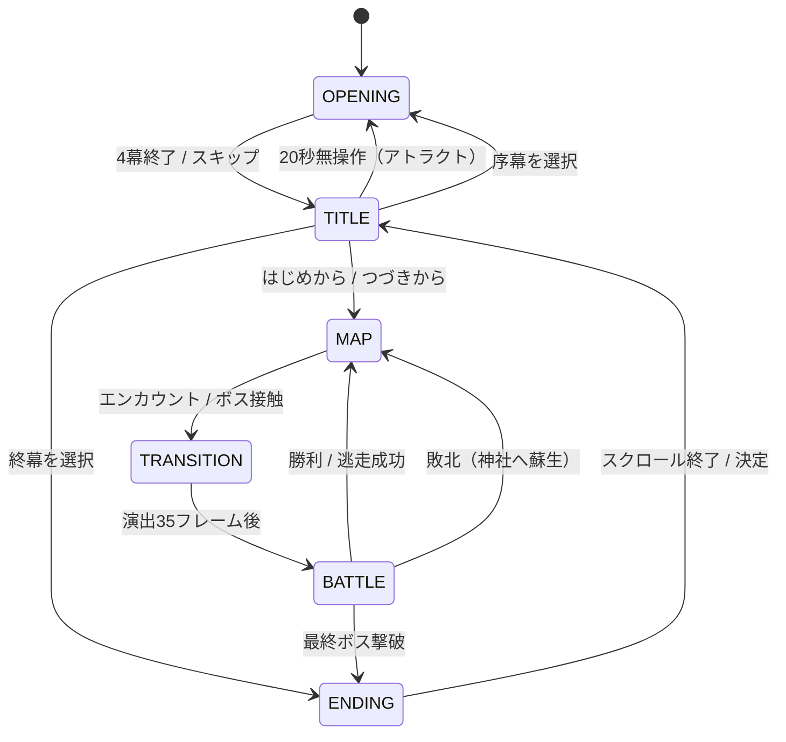

# 『妖幻奇譚 〜もののけ草子〜』要件仕様書 v1.0

**作成日**: 2026-08-31
**作成**: Claude Code（現行実装 `C:\dev\japanese-retro-rpg\` の全ソース読解に基づくリバース仕様化）
**目的**: 別端末でゼロから再実装するための、実装非依存な**仕様の正本**
**対**: `DESIGN_技術設計書.md`（実装方式・アーキテクチャはそちらを参照）

> 本書は「何を作るか（WHAT）」を定義する。「どう作るか（HOW）」は技術設計書を参照。
> 現行実装で判明した設計上の欠陥は §12 に集約し、**再実装時に最初から作り込むべき修正**として明示する。

---

## 1. プロダクト概要

| 項目 | 内容 |
|---|---|
| タイトル | 妖幻奇譚 〜もののけ草子〜 |
| ジャンル | 和風伝奇 サイドビュー コマンドバトルRPG（全三章完結） |
| プラットフォーム | ブラウザ（スマホ: iOS Safari / Android Chrome、PC: Chrome / Edge / Safari） |
| 描画解像度 | 1280 × 960（4:3）内部固定。CSSで表示領域にフィット |
| 依存ライブラリ | なし（Vanilla JS のみ。ビルド不要、`index.html` 直開きで動作） |
| 外部アセット | なし（画像・音声ファイル一切不使用。全てコード生成） |
| 想定プレイ時間 | 30〜60分（全三章通し） |
| 通信 | 不要（完全オフライン動作。Google Fontsのみ任意でCDN取得） |

### 1.1 設計原則（再実装でも厳守）

1. **単一HTMLから即起動**: ビルドツール・パッケージマネージャ・ローカルサーバを必須にしない。
2. **アセット・ゼロ**: スプライト・タイル・BGM・SEはすべて実行時にコード生成する（Canvas 2D / Web Audio）。
3. **スマホ・ファースト**: 縦持ち片手操作を主対象とし、画面直接タップでも全操作が完結すること。
4. **60fps維持**: 生成物は初期化時にオフスクリーンCanvasへキャッシュし、毎フレームの再生成を禁止する。

---

## 2. 世界観・ストーリー要件

### 2.1 設定

舞台は神話と人の世が溶け合う島国「**葦原の国**」。百年に一度の月蝕の年、冥府を封じる結界「**常夜の門**」に亀裂が走り、漏れ出した瘴気が森の精霊や付喪神を狂暴化させた。

### 2.2 プレイアブル3名

| ID | 名前 | 職業 | 役割 | 背景要旨 |
|---|---|---|---|---|
| `hayate` | 疾風（はやて） | 侍 | 前衛・物理高火力 | 風神無想流の正統継承者。一門を妖異に滅ぼされ諸国を流浪 |
| `sayo` | 小夜（さよ） | 巫女 | 後衛・回復/浄化 | 白鷺神社の神子。人と狐神のハーフとして霊力が眠る |
| `oboro` | 朧（おぼろ） | 忍 | 中衛・高速/搦手 | 月影忍軍の若き頭領。常夜の門の監視者 |

### 2.3 章構成とクライマックス

| 章 | 舞台 | 中ボス1 | 中ボス2 | 章ボス | 獲得神具 |
|---|---|---|---|---|---|
| 第一章 | 神楽の里・竹林渓谷・妖しの森 | 赤鬼・羅刹 | 大天狗・疾風坊 | 九尾の妖狐・茜（幻影） | — |
| 第二章 | 不知火の湊・霊峰白嶺・神仙湖 | 雪女・氷華 | 水神・蛟龍 | 妖魔将・酒呑童子 | 八咫の鏡 / 八尺瓊勾玉 |
| 第三章 | 魔都平安帝都・羅生門・常夜の回廊 | 鬼将・茨木童子 | 亡霊剣聖・無想影 | 真・九尾の天狐・茜 | 草薙の剣 |

**結末**: 茜の哀しみを小夜の祈りが受け止め、常夜の門を三神具で封印。茜は千歳杉の守り神へ昇華する大団円。テーマは「人の心に優しさがある限り、もののけと人は共に生きていける」。

> 各章の全シナリオ本文は `chapter1_story.md` / `chapter2_story.md` / `chapter3_story.md` を正本とする。

---

## 3. 画面構成とゲームフロー

### 3.1 状態遷移



### 3.2 各画面の要件

#### OPENING（序幕）— 四幕構成のシネマティック演出

| 幕 | 名称 | 尺 | 内容 |
|---|---|---|---|
| 1 | `prologue_moon` | 320F | 皆既月蝕の夜空。赤い月と欠けた影。「千年の時を超え、皆既月蝕の夜が訪れる……」 |
| 2 | `akane_awaken` | 360F | 大妖狐・茜の降臨。「人は我が一族を裏切った……許しはせぬ……」 |
| 3 | `heroes_assemble` | 360F | 英傑三人の集結。「立ち向かうは、運命に導かれし三人の英傑。」 |
| 4 | `title_drop` | 320F | タイトルロゴ表示 |

- 全幕を通して50個の花弁/光パーティクルが降る。
- 画面タップまたは決定/取消キーで**いつでもスキップ可能**（点滅ガイドを常時表示）。
- 幕の切り替わりで効果音を鳴らす（幕2: 低音、幕3: 斬撃音、幕4: 鈴音）。

#### TITLE（タイトル）

- メニュー4項目: `はじめから` / `つづきから` / `序幕（オープニング）` / `終幕（エンディング）`
- セーブデータがある場合、初期カーソルを `つづきから` に合わせる。無い場合は `つづきから (無)` とグレー表示し選択不可。
- 50枚の桜花弁アニメーション、3キャラの立ち絵表示。
- **20秒（1200フレーム）無操作でOPENINGへ自動遷移**（アトラクトモード）。
- タップ操作: メニュー項目のY座標帯（600-672 / 672-744 / 744-816 / 816-900）を直接タップで選択実行。

#### MAP（探索）

- 72×48グリッド、1タイル64px。プレイヤー中心のスクロール（マップ端でクランプ）。
- 3人が縦列で追従（先頭:侍、中:巫女 -52px、後:忍 -104px。進行方向の逆側にオフセット）。
- 画面左上に現在章のラベルを常時表示。
- **サブ画面**: ポーズメニュー / つよさ（能力）画面 / 会話ダイアログ。

#### BATTLE（戦闘）

- サイドビュー。敵は画面左、味方は画面右に配置。
- 下部にメッセージウィンドウ（最新4件）とコマンドウィンドウ。
- 詳細は §6。

#### ENDING（終幕）

- 朝焼けのグラデーション背景＋3キャラ立ち絵。
- クレジットが下から上へスクロール（1.8px/フレーム）。
- 1200フレーム経過で自動終了。300フレーム以降はタップ/決定で終了可能（誤爆防止のため200フレーム未満は無反応）。

---

## 4. キャラクター・成長仕様

### 4.1 初期ステータス

| ID | 名前 | Lv | HP | MP | ATK | DEF | MATK | SPD | 次Lv必要EXP | 初期スキル |
|---|---|---|---|---|---|---|---|---|---|---|
| hayate | 疾風 | 1 | 52 | 14 | 20 | 13 | 7 | 15 | 30 | 居合い一閃 / 真空波 |
| sayo | 小夜 | 1 | 38 | 32 | 9 | 10 | 22 | 11 | 30 | 破魔の光 / 神気治癒 / 火炎の符 |
| oboro | 朧 | 1 | 44 | 20 | 16 | 11 | 14 | 22 | 30 | 手裏剣乱舞 / 雷遁の術 / 影縫いの術 |

`row` フィールド（0/1/2）が戦闘・マップ描画時の縦位置と隊列順を決める。

### 4.2 レベルアップ

- **上限 Lv.10**。
- 必要EXPは `nextExp = floor(nextExp × 1.8)`（初期30 → 54 → 97 → 174 → ...）。
- 1回のレベルアップにつき: `maxHP +12` `maxMP +6` `ATK +4` `DEF +3` `MATK +3` `SPD +2`。HP/MPは最大値まで全回復。
- **経験値は戦闘に参加し生存している者のみ取得**（戦闘不能者は取得しない）。
- 1回の戦闘で複数レベル上がりうるため、判定は `while` ループで行うこと。

### 4.3 習得スキル

| Lv | 疾風 | 小夜 | 朧 |
|---|---|---|---|
| 3 | 風刃乱舞 | 清めの結界 | 変わり身の術 |
| 5 | 明鏡止水 | 神気大治癒 | 水遁・濁流波 |
| 7 | 奥義・天翔風塵斬 | 秘術・天恵浄化光 | 禁術・月影乱れ千鳥 |

---

## 5. 技・アイテム仕様

### 5.1 技・術 全18種

| ID | 名称 | MP | 分類 | 対象 | 威力 | エフェクト |
|---|---|---|---|---|---|---|
| `iai` | 居合い一閃 | 3 | 物理 | 敵単体 | 1.6 | slash |
| `shinku_ha` | 真空波 | 6 | 物理 | 敵全体 | 1.15 | wind |
| `fujin_ranbu` | 風刃乱舞 | 8 | 物理 | 敵単体 | 2.3 | slash_heavy |
| `meikyo_shisui` | 明鏡止水 | 6 | 強化 | 自身 | — | **自身ATK+35% / SPD+25%** |
| `tensho_fujin` | 奥義・天翔風塵斬 | 14 | 物理 | 敵全体 | 2.6 | tornado |
| `hama_hikari` | 破魔の光 | 5 | 魔法 | 敵単体 | 1.8 | holy |
| `shinki_chiyu` | 神気治癒 | 4 | 回復 | 味方単体 | 50 | heal |
| `kaen_fu` | 火炎の符 | 8 | 魔法 | 敵全体 | 1.35 | fire |
| `kiyome_kekkai` | 清めの結界 | 7 | 強化 | 味方全体 | — | **生存者全員DEF+35%** |
| `shinki_daichiyu` | 神気大治癒 | 10 | 回復 | 味方全体 | 65 | heal |
| `tenkei_joka` | 秘術・天恵浄化光 | 18 | 魔法 | 敵全体 | 2.8 | holy_pillar |
| `shuriken` | 手裏剣乱舞 | 4 | 物理 | 敵全体 | 1.15 | slash |
| `raiton` | 雷遁の術 | 7 | 魔法 | 敵単体 | 2.1 | thunder |
| `kagenui` | 影縫いの術 | 5 | 物理 | 敵単体 | 1.45 | slash |
| `kawarimi` | 変わり身の術 | 6 | 強化 | 自身 | — | **次の被弾を1回だけ完全回避** |
| `suiton` | 水遁・濁流波 | 10 | 魔法 | 敵全体 | 1.8 | water |
| `midare_chidori` | 禁術・月影乱れ千鳥 | 15 | 魔法 | 敵単体 | 3.2 | purple_lightning |

**回復量計算**: `skill.power + floor(使用者MATK × 1.2)`

### 5.2 アイテム 全3種

| ID | 名称 | 初期数 | 効果 |
|---|---|---|---|
| `kizugusuri` | 傷薬 | 9 | 味方単体のHPを50回復 |
| `miki` | 神酒 | 6 | 味方単体のMPを30回復 |
| `senzu` | 仙豆 | 4 | 戦闘不能の味方1名を蘇生（最大HPの50%で復帰） |

**要件**: 3種すべて**戦闘中とマップ上の両方から使用できること**（現行実装ではマップ側が未配線。§12 B-4参照）。

---

## 6. 戦闘システム仕様

### 6.1 ターン進行

```
1. コマンド入力フェーズ（INPUT）
   生存パーティを row 順に1人ずつ選択 → 行動をキューに積む
   （B/取消で前の味方の入力に戻れる）
2. 敵行動決定
   生存する各敵が、行動テーブルからランダムに1つ選択し、
   生存する味方からランダムに1人をターゲットにしてキューに積む
3. 行動順ソート
   全アクションを「実効SPD = spd × buffSpd」の降順に並べる
4. 順次実行（EXECUTING）
   1件ずつ実行 → 演出待ち → 次へ。実行前に毎回、勝敗判定を行う
5. キューが空 → 1へ戻る
```

### 6.2 ダメージ計算式

| 種別 | 式 |
|---|---|
| 味方の通常攻撃 | `max(1, floor(ATK × buffAtk × 1.4 − 対象DEF × 対象buffDef × 0.7 + rand(−2,+2)))` |
| 味方の**物理**技 | `max(1, floor(ATK × buffAtk × 1.4 × power − 対象DEF × 0.5 + rand(−3,+3)))` ※§12 B-1 の修正後の式 |
| 味方の**魔法**技 | `max(1, floor(MATK × 1.8 × power − 対象DEF × 0.4 + rand(−3,+3)))` |
| 敵の行動 | `max(1, floor(ATK × power × 1.2 − 対象DEF × 対象buffDef × 0.6 + rand(−2,+2)))` |

> **重要**: 技は `type: 'physical' / 'magical'` を持つ。**この分類に応じて計算式を切り替えること**。現行実装は分類を無視して全技をMATK基準にしており、侍・忍の物理技が通常攻撃より弱いという致命的な不整合が発生している（§12 B-1）。

### 6.3 バフ・状態

| 効果 | 適用 | 解除タイミング |
|---|---|---|
| `buffAtk` (1.35) | 明鏡止水 使用者 | 戦闘終了時 |
| `buffSpd` (1.25) | 明鏡止水 使用者 | 戦闘終了時 |
| `buffDef` (1.35) | 清めの結界 → 生存する味方全員 | 戦闘終了時 |
| `hasEvasion` | 変わり身の術 使用者 | **被弾1回で消費** |

- バフ値は戦闘開始時に全員 `1.0` で初期化する。**敵にも `buffSpd` を必ず持たせること**（欠落すると行動順ソートがNaNで壊れる。§12 B-3）。
- バフはダメージ計算の全式に一貫して適用すること（現行は技ダメージに `buffAtk` が乗らない）。

### 6.4 コマンド

| コマンド | 挙動 |
|---|---|
| こうげき | 敵単体を選択して通常攻撃 |
| わざ・じゅつ | 習得技一覧 → MP判定 → 対象選択（単体技のみ）→ キュー |
| どうぐ | 所持アイテム一覧 → 対象選択 → キュー。仙豆は戦闘不能者のみ選択可 |
| にげる | 65%で成功し戦闘終了。失敗するとそのキャラのターンを消費。**ボス戦は不可** |

MP不足時・アイテム所持数0時はメッセージを出して選択を弾く（キューに積まない）。

### 6.5 勝敗

**勝利**: 敵全滅。
- 撃破した敵の `exp` / `money` の合計を算出。
- `GAME_DATA.money` に加算。
- 生存者に経験値を配分しレベルアップ判定。
- **戦闘結果（Lv/HP/MP/EXP/習得スキル）をマスターデータへ確実に書き戻す**（§12 B-2）。

**敗北**: 味方全滅。
- 白鷺神社へ強制送還。
- **パーティのHP/MPを全回復させること**（回復しないと再戦闘で即敗北の無限ループに陥る）。

### 6.6 敵データ

全50種＋ボス9体。各敵は以下を持つ:

```
{ id, name, maxHp, hp, atk, def, spd, exp, money, spriteKey, isBoss?, actions: [{ type, name, rate, power? }] }
```

- `actions` の `rate` は出現率（%）を意図した値だが、**現行実装は完全ランダム選択で rate を無視している**。再実装では重み付き抽選を実装すること（§12 B-5）。
- `type` は演出（エフェクト種別）に加え、`heal`（自己回復）/ `defend`（防御）/ `luck` 等の**行動の意味も表すべき**だが、現行は全て「味方へのダメージ」として処理している（§12 B-6）。

#### 敵ステータス一覧（章別）

**第一章（20種）**

| ID | 名称 | HP | ATK | DEF | SPD | EXP | 文 |
|---|---|---|---|---|---|---|---|
| karakasa | から傘小僧 | 32 | 12 | 5 | 12 | 12 | 14 |
| chochin | 提灯お化け | 40 | 15 | 7 | 8 | 16 | 18 |
| ittanmomen | 一反木綿 | 46 | 17 | 8 | 18 | 22 | 22 |
| tanuki | 化け狸 | 50 | 16 | 10 | 10 | 25 | 30 |
| kitsunebi | 狐火 | 35 | 18 | 4 | 16 | 20 | 15 |
| rokurokubi | ろくろ首 | 58 | 20 | 9 | 14 | 32 | 35 |
| wanyudo | 輪入道 | 65 | 22 | 12 | 13 | 40 | 42 |
| kappa | 河童 | 54 | 19 | 11 | 15 | 30 | 28 |
| nurikabe | ぬりかべ | 90 | 18 | 20 | 5 | 45 | 40 |
| kamaitachi | 鎌鼬 | 52 | 24 | 8 | 25 | 38 | 36 |
| dorotabo | 泥田坊 | 68 | 21 | 13 | 7 | 36 | 32 |
| akaname | 垢嘗 | 44 | 16 | 8 | 13 | 24 | 20 |
| kodama | 木霊 | 38 | 14 | 12 | 16 | 28 | 25 |
| tsurube | 釣瓶落とし | 62 | 26 | 10 | 11 | 42 | 38 |
| nue | 鵺 | 85 | 28 | 14 | 19 | 60 | 65 |
| nekomata | 猫又 | 56 | 23 | 9 | 22 | 35 | 35 |
| zashiki | 座敷童子 | 48 | 15 | 14 | 17 | 50 | 80 |
| mushakage | 武者影 | 78 | 27 | 16 | 12 | 55 | 50 |
| hyakume | 百目 | 82 | 25 | 15 | 10 | 58 | 55 |
| gaki | 餓鬼 | 46 | 20 | 6 | 15 | 26 | 18 |

**第二章（15種）**

| ID | 名称 | HP | ATK | DEF | SPD | EXP | 文 |
|---|---|---|---|---|---|---|---|
| yukionna_mob | 雪女 | 75 | 26 | 12 | 16 | 70 | 60 |
| hyouro | 氷狼 | 68 | 29 | 11 | 22 | 65 | 55 |
| yukiwarashi | 雪童子 | 52 | 22 | 14 | 18 | 58 | 50 |
| umibozu | 海坊主 | 110 | 30 | 18 | 8 | 90 | 85 |
| funayurei | 舟幽霊 | 62 | 25 | 10 | 15 | 68 | 62 |
| ushioni | 牛鬼 | 120 | 34 | 20 | 10 | 110 | 100 |
| suiko | 水虎 | 72 | 28 | 13 | 19 | 75 | 70 |
| nureonna | 濡女 | 80 | 27 | 12 | 17 | 80 | 75 |
| isoonna | 磯女 | 70 | 26 | 11 | 18 | 72 | 68 |
| yamauba | 山姥 | 88 | 32 | 14 | 14 | 85 | 80 |
| aobozu | 青坊主 | 95 | 30 | 16 | 11 | 88 | 82 |
| yasha | 夜叉 | 105 | 36 | 15 | 21 | 120 | 110 |
| ichimoku | 一目入道 | 85 | 28 | 15 | 12 | 78 | 70 |
| kagebozu | 影坊主 | 65 | 31 | 9 | 24 | 82 | 76 |
| mizuchi_mob | 水蛇精 | 76 | 29 | 13 | 18 | 84 | 78 |

**第三章（15種）**

| ID | 名称 | HP | ATK | DEF | SPD | EXP | 文 |
|---|---|---|---|---|---|---|---|
| gashadokuro | がしゃどくろ | 150 | 42 | 24 | 8 | 160 | 140 |
| tsuchigumo | 土蜘蛛 | 130 | 38 | 18 | 18 | 140 | 120 |
| kyokotsu | 狂骨 | 95 | 35 | 12 | 20 | 125 | 110 |
| onmoraki | 陰摩羅鬼 | 100 | 37 | 14 | 22 | 135 | 115 |
| gozuki | 牛頭鬼 | 160 | 44 | 22 | 12 | 170 | 150 |
| mezuki | 馬頭鬼 | 145 | 41 | 20 | 19 | 165 | 145 |
| oboroguruma | 朧車 | 140 | 39 | 25 | 11 | 155 | 130 |
| hyakki_soldier | 百鬼夜行兵 | 115 | 36 | 16 | 16 | 130 | 120 |
| jashinkyo | 邪神鏡 | 90 | 32 | 28 | 14 | 145 | 135 |
| yashahime | 夜叉姫 | 125 | 43 | 17 | 25 | 180 | 160 |
| yomishikome | 黄泉醜女 | 110 | 40 | 15 | 26 | 150 | 125 |
| ibaraki_soldier | 茨木鬼兵 | 135 | 42 | 19 | 15 | 160 | 140 |
| nue_mutant | 鵺・変異種 | 160 | 45 | 20 | 23 | 195 | 180 |
| tokoyo_guard | 常夜の番人 | 170 | 46 | 24 | 17 | 210 | 200 |
| tamamo_fox | 玉藻の妖狐 | 120 | 44 | 18 | 24 | 200 | 220 |

**ボス（9体）**

| ID | 名称 | 章 | HP | ATK | DEF | SPD | EXP | 文 |
|---|---|---|---|---|---|---|---|---|
| akaoni | 赤鬼・羅刹 | 1 | 180 | 28 | 14 | 10 | 150 | 200 |
| tengu | 大天狗・疾風坊 | 1 | 210 | 32 | 15 | 24 | 220 | 300 |
| youko | 九尾の妖狐・茜 | 1 | 280 | 36 | 18 | 18 | 350 | 500 |
| hyoka | 雪女・氷華 | 2 | 320 | 38 | 18 | 20 | 420 | 600 |
| mizuchi_boss | 水神・蛟龍 | 2 | 380 | 42 | 22 | 16 | 550 | 800 |
| shuten | 妖魔将・酒呑童子 | 2 | 460 | 48 | 25 | 18 | 750 | 1200 |
| ibaraki | 鬼将・茨木童子 | 3 | 520 | 52 | 26 | 22 | 950 | 1500 |
| musokage | 亡霊剣聖・無想影 | 3 | 580 | 58 | 28 | 28 | 1200 | 2000 |
| shin_youko | 真・九尾の天狐・茜 | 3 | 750 | 65 | 32 | 25 | 3000 | 5000 |

各ボスは対峙時に専用の口上（`bossEvents`）を表示してから戦闘に入る。

### 6.7 エンカウントテーブル

エリア種別ごとに「敵2体の組み合わせ × 重み」を定義する。

| エリア | 組み合わせ（重み） |
|---|---|
| `plains` | から傘+提灯(35) / 化け狸+垢嘗(35) / 狐火+木霊(30) |
| `bamboo` | 鎌鼬+一反木綿(35) / 河童+泥田坊(35) / ろくろ首+猫又(30) |
| `forest` | 輪入道+ぬりかべ(30) / 釣瓶+餓鬼(35) / 武者影+百目(35) |
| `deep_forest` | 鵺+武者影(40) / 輪入道+百目(30) / 鵺+座敷童子(30) |
| `snow_mountain` | 雪女+氷狼(40) / 雪童子+山姥(35) / 氷狼+雪童子(25) |
| `lake_underwater` | 海坊主+舟幽霊(35) / 水虎+濡女(35) / 牛鬼+水蛇精(30) |
| `port_coast` | 磯女+青坊主(35) / 夜叉+一目入道(35) / 影坊主+舟幽霊(30) |
| `capital_street` | がしゃどくろ+土蜘蛛(35) / 百鬼兵+朧車(35) / 狂骨+陰摩羅鬼(30) |
| `rashomon_gate` | 牛頭鬼+馬頭鬼(35) / 茨木鬼兵+夜叉姫(35) / 鵺変異+邪神鏡(30) |
| `tokoyo_corridor` | 常夜番人+玉藻(40) / 黄泉醜女+常夜番人(35) / 玉藻+鵺変異(25) |

---

## 7. マップ・探索仕様

### 7.1 基本パラメータ

| 項目 | 値 |
|---|---|
| グリッド | 72 × 48 タイル |
| タイルサイズ | 64 px |
| 移動 | グリッド単位。1マス移動を6.4px/フレームで補間（10フレームで1マス） |
| カメラ | プレイヤー中心。マップ端でクランプ |
| 歩行アニメ | 2フレーム交互（移動中0.15/フレームで進行） |

### 7.2 エンカウント判定

移動が1マス完了するたびに実行する。

```
1. ボス出現判定（該当座標範囲内かつ未撃破なら口上→ボス戦へ）
2. 現在タイルの encounterType が null なら終了（安全地帯）
3. stepsSinceEncounter++
4. 6歩目以降、確率 min(0.22, (歩数 − 5) × 0.04) で戦闘発生
5. 発生したら stepsSinceEncounter を0にリセット
```

→ 最短6歩、期待値およそ10歩前後で遭遇。安全地帯（村・神社・道）ではエンカウントしない。

### 7.3 タイル種別（全25種）

| 分類 | タイル |
|---|---|
| 地形 | `grass` `dirt` `stone` `water`※ `deep_water` `swamp` `field` `snow` `ice` `void_floor` `capital_stone` |
| 障害物 | `pine`※ `bamboo`※ `rock`※ `wall`※ `roof`※ `barrier_stone`※ `shrine_pillar`※ `dark_pillar`※ |
| 建物内 | `tatami` `wood` |
| 神社 | `torii_top` `torii_post` `lantern`※ `shrine_box`※ |

※ = 通行不可（collision）

### 7.4 章別マップ定義

#### 第一章「神楽の里と妖しの森」（開始位置: 12,14）

| 要素 | 座標 |
|---|---|
| 外周 | x=0,71 / y=0,47 → pine（通行不可） |
| 村長宅 | roof y5 x8-16 / wall y6 x8-16 / tatami y7-10 x9-15 |
| 茶屋 | roof y11 x17-22 / wood y12-15 x17-22 |
| 鍛冶屋 | roof y16 x5-10 / wall y17 x5-10 / wood y18-20 x5-10 |
| 畑 | field y22-26 x5-10 |
| 街道 | dirt 縦 y8-28 x12,13 / 横 y14,15 x4-26 |
| 川と橋 | water 縦 y2-30 x25（通行不可）、橋 wood (25,14)(25,15) |
| 参道 | stone y14,15 x26-46 / y5-14 x36,37 |
| 鳥居 | torii_top(28,13) / torii_post(28,14) |
| 灯籠 | (30/34/40/44, 13) と (30/34/40/44, 16) |
| **白鷺神社（セーブ）** | roof y3 x33-40 / wall y4 x33-40 / **shrine_box (36,5)** |
| 竹林 | y30-46 x4-35。`(x+y*2)%4===0 && (x<18||x>24)` → bamboo、`(x*y)%19===0` → rock。encounter=`bamboo` |
| 森 | y18-46 x36-56。`(x+y)%3===0 && (y<28||y>34)` → pine、`(x*y)%13===0` → swamp。encounter=`forest` |
| 深森 | y10-38 x57-70。`(x+y)%5===0` → swamp。encounter=`deep_forest` |
| 常夜の古社 | stone y16-28 x60-68、結界石 (60,15)(68,15)(60,29)(68,29)、鳥居 (59,21)(59,22) |

**ボス出現座標**: 赤鬼 x33-35 y39-41 / 大天狗 x51-53 y29-31 / 妖狐 x63-66 y20-24

#### 第二章「霊峰白嶺と湖底神殿」（開始位置: 14,18）

| 要素 | 座標 |
|---|---|
| 基盤 | 全面 water（通行不可） |
| 不知火の湊 | dirt y10-32 x4-26（通行可）、桟橋 wood y22 x2-8 |
| 宿 | roof y10 x18-24 / wall y11 x18-24 / wood y12-14 x18-24 |
| **セーブ** | **shrine_box (25,12)** |
| 霊峰白嶺 | y2-22 x28-54。`(x+y)%4===0`→ice、他snow。`(x*y)%17===0`→rock。encounter=`snow_mountain` |
| 氷晶洞 | ice y4-8 x48-53 |
| 神仙湖 | deep_water y24-46 x28-54（通行可）。encounter=`lake_underwater` |
| 湖底神殿 | stone y30-40 x34-48、柱 (34/40/46, 28) と (34/40/46, 42) |
| 港湾部 | stone y14-34 x56-70。encounter=`port_coast`。鳥居 (56,20)(56,21) |

**ボス出現座標**: 氷華 x48-52 y5-7 / 蛟龍 x42-46 y33-37 / 酒呑童子 x62-66 y22-26

#### 第三章「魔都羅生門と常夜の門」（開始位置: 10,24）

| 要素 | 座標 |
|---|---|
| 基盤 | 全面 void_floor（通行不可） |
| 平安帝都 | capital_stone y10-36 x4-24（通行可）。encounter=`capital_street` |
| 陰陽寮 | roof y8 x8-16 / wall y9 x8-16 |
| **セーブ** | **shrine_box (20,12)** |
| 羅生門 | stone y15-32 x25-40。encounter=`rashomon_gate`。鳥居 (32,20)(32,21) と (32,26)(32,27) |
| 常夜の回廊 | void_floor y10-38 x41-56（通行可）。encounter=`tokoyo_corridor`。闇柱 (43/49/55, 12) と (43/49/55, 36) |
| 終焉の祭壇 | capital_stone y14-34 x57-69。encounter=`tokoyo_corridor`。闇柱 (60,16)(66,16)(60,32)(66,32) |
| 連絡路 | capital_stone y23,24 x20-60 |

**ボス出現座標**: 茨木童子 x30-34 y22-26 / 無想影 x46-50 y22-26 / 真・茜 x62-66 y22-26

### 7.5 NPC（全17名）

| 章 | ID | 名前 | 座標 | 機能 |
|---|---|---|---|---|
| 1 | elder | 村長 | 12,10 | 導入・依頼 |
| 1 | chaya_girl | 看板娘・お花 | 18,14 | **HP/MP全回復** |
| 1 | priest | 神主 | 35,8 | セーブ方法の案内 |
| 1 | smith | 鍛冶屋・源蔵 | 8,18 | 戦術ヒント |
| 1 | boy | わんぱく小僧・太一 | 15,22 | 妖狐の情報 |
| 1 | merchant | 行商人・甚兵衛 | 22,18 | 赤鬼の情報 |
| 1 | grandma | おばあちゃん・よね | 7,26 | 小夜の出自の伏線 |
| 1 | apprentice_miko | 見習い巫女・すず | 38,11 | 激励 |
| 1 | shadow_scout | 密偵・影丸 | 28,25 | 茜の背景 |
| 1 | biwa_monk | 琵琶法師・幽玄 | 25,9 | テーマの示唆 |
| 2 | captain | 船頭・長兵衛 | 14,16 | 三神具の在処 |
| 2 | inn_keeper | 湊の女将・お志乃 | 20,12 | **HP/MP全回復** |
| 2 | onmyoji | 旅の陰陽師・蘆屋 | 25,10 | 湖底神殿の攻略 |
| 2 | fisherman | 漁師の勘助 | 10,22 | 状況説明 |
| 3 | onmyo_head | 陰陽頭・安倍 | 12,14 | **HP/MP全回復**＋導入 |
| 3 | princess | 藤原の姫君 | 18,10 | 茜への同情 |
| 3 | guard_captain | 帝都衛士頭 | 8,20 | 警告 |

- NPCのいるマスは通行不可。
- 正面で決定、または隣接（距離1.8以内）でタップして会話。
- `healParty: true` のNPCは会話終了時に全員HP/MP全快。

### 7.6 会話ダイアログ

- 1文字ずつ表示（25ms/文字相当）。2文字ごとに880Hzの短いポップ音。
- 表示途中で決定 → 全文即時表示。全文表示済みで決定 → 次のメッセージ or 閉じる。
- `\n` で改行対応。閉じる際に `onComplete` コールバックを実行（回復・ボス戦開始などに使用）。

### 7.7 ポーズメニュー

| 項目 | 機能 |
|---|---|
| つよさ（能力） | ステータス画面へ。左右でキャラ切替。習得技と説明を表示 |
| どうぐ | **アイテム使用画面**（所持金・三神具の所持状況も表示） |
| 章のいどう | 次章へ移動（1→2→3→1の循環） |
| きろく（セーブ） | セーブ実行＋HP/MP全回復 |
| とじる | メニューを閉じる |

**セーブ**: 各章の `shrine_box`（神鏡）に隣接して決定/タップ、またはメニューから実行。**セーブ時はHP/MP全快とする**（宿屋の役割を兼ねる）。

---

## 8. セーブ仕様

- 保存先: `localStorage`
- キー: `YOUGEN_KITAN_SAVEDATA_V1`
- スロット: 1つのみ（上書き）

### 8.1 スキーマ

```jsonc
{
  "savedAt": "8/31 21:33",          // 表示用の保存日時
  "currentChapter": 2,               // 現在の章 (1-3)
  "money": 1250,                     // 所持金（文）
  "party": [ /* GAME_DATA.party 全体 */ ],
  "items": [ /* GAME_DATA.items 全体 */ ],
  "bossDefeated": {                  // ボス撃破フラグ 9種
    "akaoni": true, "tengu": true, "youko": true,
    "hyoka": false, "mizuchi": false, "shuten": false,
    "ibaraki": false, "musokage": false, "shin_youko": false
  },
  "artifactsObtained": {             // 三神具
    "mirror": false, "magatama": false, "sword": false
  },
  "player": { "gridX": 14, "gridY": 18, "facing": "down" }
}
```

### 8.2 ロード手順（順序厳守）

1. `currentChapter` を読み、**先に該当章のマップを構築**する
2. `bossDefeated` / `artifactsObtained` を復元
3. `money` を復元
4. `party` / `items` を復元
5. **最後に**プレイヤー座標を復元（マップ構築より前に置くと座標が巻き戻る）

### 8.3 例外処理

`localStorage` はプライベートブラウジング等で例外を投げうるため、読み書きすべてを try-catch で保護し、失敗時は `false` を返して呼び出し側でフォールバックする。

---

## 9. 操作仕様

### 9.1 入力デバイス

| 操作 | キーボード | 仮想パッド | 画面タップ |
|---|---|---|---|
| 移動 | 方向キー / WASD | D-Pad（スライド追従・マルチタッチ対応） | 移動先タップで1マス移動 |
| 決定・話す・攻撃 | Z / Enter / Space | Aボタン | 対象を直接タップ |
| 取消・メニュー | X / Esc / Shift | Bボタン | — |

### 9.2 タッチ操作要件

- **D-Pad はスライド追従**: `touchstart` / `touchmove` で中心からの角度を判定し、デッドゾーン12px以上で4方向を決定。指を滑らせたまま方向転換できること。
- **画面直接タップ**で全画面の操作が完結すること（D-Padに触れずに一周クリア可能であること）。
- キャンバス座標変換: `(clientX − rect.left) / rect.width × 1280`（表示サイズに依らず内部座標へ正規化）。
- `touchstart`/`touchmove` は `{ passive: false }` で登録し `preventDefault()` すること（スクロール・ズーム誤爆防止）。

### 9.3 誤操作防止（CSS要件）

```css
* { touch-action: none; user-select: none; -webkit-tap-highlight-color: transparent;
    -webkit-touch-callout: none; }
html, body { overflow: hidden; position: fixed; }
```
`<meta name="viewport" content="width=device-width, initial-scale=1.0, maximum-scale=1.0, user-scalable=no, viewport-fit=cover">`

### 9.4 画面レイアウト

| 領域 | 要件 |
|---|---|
| ヘッダー | タイトルロゴ、音量トグルボタン。コンパクトに（画面領域を最大化） |
| ゲーム画面 | アスペクト比4:3固定、縦最大62vh（小型端末は56vh） |
| コントローラー | 下端固定。D-Pad（40px×3グリッド）とA/Bボタン（58px円形） |
| 横持ち時 | コントローラーを画面上にオーバーレイ（半透明）、画面を96vhまで拡大 |
| セーフエリア | `env(safe-area-inset-*)` に対応（iPhoneのノッチ/ホームバー） |

---

## 10. グラフィック仕様

### 10.1 解像度規格

| 対象 | サイズ | 個数 |
|---|---|---|
| マップタイル | 64 × 64 | 25種 |
| 歩行スプライト | 64 × 64 | 3キャラ × 4方向 × 2フレーム = 24 |
| 戦闘スプライト | 128 × 128 | 3キャラ × 4ポーズ(idle/attack/cast/hit) = 12 |
| NPCスプライト | 64 × 64 | 9種 |
| 敵スプライト | 128 × 128 | 50種 |
| ボススプライト | 192 × 192 | 9種 |
| 顔ポートレート | 128 × 128 | 3種 |

**全アセットは起動時にオフスクリーンCanvasへ描画してキャッシュする**（毎フレーム生成は禁止）。

### 10.2 フォント

- 使用: `Zen Kaku Gothic New` / `Noto Sans JP`（Google Fonts）、フォールバックに `Hiragino Sans` / `Yu Gothic` / `sans-serif`。
- **全テキストは黒フチ取り必須**: `strokeText`（`lineJoin: 'round'`, `lineWidth` 3〜6）→ `fillText` の順で描画。背景に埋もれず、レトロRPGの視認性を確保する。
- 主要サイズ: タイトル72px / 見出し36px / 本文26-30px / 補助22-24px。

### 10.3 戦闘背景（4種）

| 種別 | 使用章 | 内容 |
|---|---|---|
| `night` | 第一章 | 満月の和風夜空。星、月のラジアルグラデーション、大地 |
| `snow` | 第二章（雪山系の敵） | 寒色の空と白い雪原 |
| `lake` | 第二章（それ以外） | 深い水中のグラデーション |
| `tokoyo` | 第三章 | 紫の虚空と血のように紅い月 |

### 10.4 UI枠「漆枠（Urushi Frame）」

全ウィンドウ共通の意匠。黒地（`#16101c`）＋金の外枠（`#b8860b`）＋朱の内枠（`#9e2a2b`）＋四隅の金飾り。タイトル付きの場合は上辺に朱色のタブを重ねる。

### 10.5 技エフェクト（13種）

`slash` / `slash_heavy` / `tornado` / `holy` / `holy_pillar` / `fire`(=`foxfire`) / `blizzard` / `ice_spear` / `water` / `thunder` / `purple_lightning` / `dark_slash` / `heal` / `buff`

いずれも `(ctx, x, y, progress 0→1)` のシグネチャで、進行度に応じて拡大・移動・フェードする。

---

## 11. サウンド仕様

### 11.1 方式

Web Audio API による完全シンセサイズ（音声ファイル不使用）。和風の**都節音階**を基調とする。

### 11.2 ノードグラフ

```
Oscillator/Noise → GainNode(エンベロープ) ┬→ bgmGain(0.35) ┐
                                          └→ seGain (0.50) ┴→ masterGain(0.40) → destination
```

### 11.3 iOS / Android 自動再生対策（必須）

- 初回のユーザー操作（キー入力・タッチ・クリック）で `AudioContext` を生成し `resume()` する。
- 長さ1サンプルの無音バッファを再生してロックを解除する。
- `webkitAudioContext` へのフォールバックを行う。
- 以降の全発音前に `state === 'suspended'` なら `resume()` を試みる。

### 11.4 BGM（4種）

| 名称 | テンポ | 構成 |
|---|---|---|
| `opening` | 300ms/step | 荘厳な都節の主旋律＋1オクターブ下のsine |
| `title` | 280ms/step | 静かな都節＋低音 |
| `village` | 220ms/step | 主旋律(triangle)＋ベース(sine) |
| `battle` | 140ms/step | 疾走する主旋律(sawtooth)＋16分ベース(square) |

各BGMは32ステップのメロディ配列（`'0'` は休符）をループする。

> **実装要件**: `setInterval` による発音ではなく、**先読みスケジューラ（lookahead）**で `AudioContext.currentTime` 基準に予約すること。タブのバックグラウンド化やメインスレッド負荷でテンポが乱れないようにする（§12 B-7）。

### 11.5 効果音（12種）

`cursor`（カーソル移動） / `decide`（決定） / `cancel`（取消） / `save`（記録・鈴の音） / `slash`（斬撃・バンドパスノイズ） / `magic`（術発動・上昇音階） / `hit`（被弾） / `heal`（回復・上昇音階） / `enemyDead`（敵撃破・下降スイープ） / `encounter`（遭遇） / `victory`（勝利ファンファーレ） / 会話文字送り音

### 11.6 音量制御

ヘッダーのトグルボタンでミュート切替（`masterGain` を 0 / 0.4）。アイコンは 🔊 / 🔇。

---

## 12. 再実装時に必ず修正すべき既知の課題

現行実装のレビューで検出された課題。**再実装では最初からこの仕様で作ること**。詳細な検証記録は `code_review_report_claudecode.md` を参照。

### B-1【重大・未修正】技の物理/魔法分類がダメージ計算で無視されている

技データは `type: 'physical' / 'magical'` を持つが、エンジンは分類を読まず**全ダメージ技をMATK基準**で計算している（`skill.type` の参照箇所がコード全体に0件）。

結果、Lv1の疾風では:
- 通常攻撃 = `20 × 1.4` = **28**
- 居合い一閃（3MP消費） = `7 × 1.8 × 1.6` = **20**

→ **MPを払うほど弱くなる**。侍・忍の物理技（居合い一閃・真空波・風刃乱舞・奥義・手裏剣乱舞・影縫い）が全て死に技になっている。§6.2 の式で分岐実装すること。

### B-2【対処済・要再実装】戦闘結果のマスターデータ書き戻し

戦闘用パーティをマスターデータから複製する設計にする場合、**戦闘終了時に必ず書き戻す**こと（Lv/HP/MP/EXP/習得スキル）。勝利・敗北・逃走の全経路で実行する。書き戻しを忘れると、成長・被ダメージが一切永続しない。

### B-3【対処済・要再実装】バフ変数の初期化漏れ

味方・敵の**双方**に `buffAtk` `buffDef` `buffSpd` を必ず `1.0` で初期化すること。片方でも欠けると行動順ソートの計算が `NaN` になり、素早さによる行動順制御が完全に機能しなくなる。

### B-4【未修正】マップ上のアイテム使用が未配線

アイテム使用ロジックを実装しても、**メニューのUI（一覧→対象選択→実行）に配線しなければプレイヤーは到達できない**。現行実装では `useItemOnMap()` 関数が存在するが呼び出し元が0件で、機能していない。同種の問題が戦闘の「どうぐ」でも過去に発生している。

> **教訓**: 関数の単体テストだけでなく、**メニュー入力 → 状態遷移 → 関数実行のUI経路を通しで検証する**こと。

### B-5【未修正】敵の行動 `rate`（出現率）が無視されている

敵データの `actions[].rate` は出現率（%）を意図しているが、実装は完全ランダム選択。ボスの「大技は45%、通常攻撃は30%」といった行動パターン設計が全く効いていない。重み付き抽選を実装すること。

### B-6【未修正】敵行動の `type` が全てダメージ処理されている

`type: 'heal'`（木霊の「森の癒し」＝本来は自己回復）、`type: 'defend'`（ぬりかべの「鉄壁の構え」）、`type: 'luck'`（座敷童子の「福授け」）などが、すべて「味方へのダメージ」として処理されている。行動タイプごとの効果を実装すること。

### B-7【未修正】BGMのタイミング制御

§11.4 のとおり先読みスケジューラで実装すること。

### B-8【未修正】章移動に進行条件チェックがない

「章のいどう」はいつでも次章へ跳べるため、Lv.1のまま最終章の敵（HP150〜750）に遭遇できてしまう。ボス撃破・神具取得を前提条件にするか、意図的な自由移動なら仕様として明記すること。

### B-9【未修正】敵グラフィックの作り込み不足

主人公3名とポートレートは陰影・ハイライト付きで作り込まれている一方、**敵50種の多く（特に第二章・第三章）は矩形/円を2〜3個重ねただけ**で種族の判別が困難。「ハイレゾHD-2D」を訴求するなら、少なくとも各章の主要敵にはディテールが必要。

### B-10【未修正】`image-rendering` の設定矛盾

JS側は `imageSmoothingEnabled = false`（クリスプ）だが、CSS側は `image-rendering: auto`（補間あり）。ドット感を出すなら `pixelated` に統一し、滑らかさを狙うなら訴求文言側を合わせること。

### B-11【未修正】戦闘演出が `setTimeout` チェーン依存

演出待ちを `setTimeout` の入れ子で実装しているため、①メインループと二重の時間管理になる、②スキップ・早送りを実装できない、③タイマーIDを保持していないため状態遷移時にキャンセルできない。**経過フレーム数ベースのステートマシン**で実装すること（§技術設計書 参照）。

### B-12【未修正】ボス出現座標がマップデータと独立したハードコード

ボス判定が `gridX >= 33 && gridX <= 35 && ...` の形で座標直書きされており、マップ生成コードと同期していない。マップ生成時に `bossEventGrid[y][x] = 'akaoni'` の形で埋め込む方式にすると、マップ調整時のズレを防げる。

### B-13【未修正】Webフォント読み込み待ちがない

`document.fonts.ready` を待たずに描画開始するため、低速回線では初期数フレームがフォールバックフォントになる。

---

## 13. 非機能要件

| 分類 | 要件 |
|---|---|
| パフォーマンス | 1280×960で常時60fps。毎フレームのオブジェクト生成・スプライト再生成を禁止。タイル描画は可視範囲のみ（カリング必須） |
| メモリ | 生成スプライト総数 約107枚。初期化後は追加確保しない |
| 起動時間 | 全アセット生成を含めて2秒以内 |
| 互換性 | iOS Safari 15+ / Android Chrome 100+ / デスクトップ Chrome・Edge・Safari 最新 |
| オフライン | 初回読み込み後、Google Fonts以外の通信なしで完全動作 |
| 保守性 | 敵・技・NPC・エンカウントの追加がデータ定義の追記のみで完結すること（第四章の追加を想定） |

---

## 14. 将来拡張の想定

再実装時、以下を見越したデータ構造にしておくこと。

- **第四章以降の追加**: 章番号のハードコード（`chapter % 3 + 1` など）を避け、章定義を配列データ化する。
- **装備システム**: パーティに `equipment` スロットを持たせられる構造にする。
- **ショップ**: `money` は既に存在するが使い道がない。購入UIを追加できるようアイテムに `price` を持たせる。
- **状態異常**: 敵行動に `poison` `curse` などの type が既にあるため、状態異常システムの受け皿を用意する。
- **セーブスロット複数化**: キーに連番を付けられる設計にする。

---

## 付録A: 現行実装のファイル構成（参考）

| ファイル | 行数目安 | 責務 |
|---|---|---|
| `index.html` | 82 | エントリポイント、Canvas、仮想パッドDOM |
| `css/style.css` | 365 | 筐体UI、D-Pad、レスポンシブ、セーフエリア |
| `js/data.js` | ~330 | 全ゲームデータ定義 |
| `js/graphics.js` | 1281 | スプライト生成、背景、UI枠、エフェクト、文字描画 |
| `js/map.js` | ~600 | マップ生成、探索、NPC、メニュー、セーブ点 |
| `js/battle.js` | ~830 | 戦闘進行、コマンド、ダメージ計算、戦闘UI |
| `js/audio.js` | 353 | Web Audio シンセ（BGM4種・SE12種） |
| `js/opening.js` | 187 | 四幕オープニング演出 |
| `js/ending.js` | 120 | エンディング演出 |
| `js/save.js` | 135 | localStorage 永続化 |
| `js/main.js` | ~500 | 入力管理、メインループ、状態遷移、タイトル |

読み込み順（依存関係の都合で厳守）:
`data.js → save.js → audio.js → graphics.js → opening.js → ending.js → map.js → battle.js → main.js`
