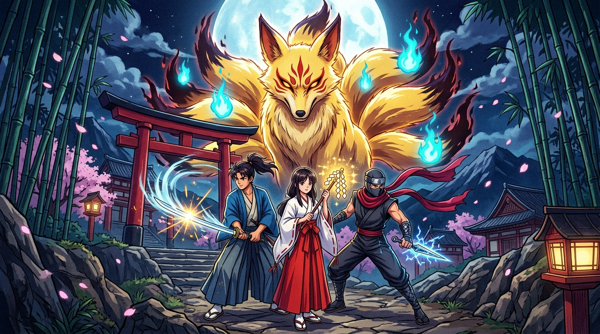
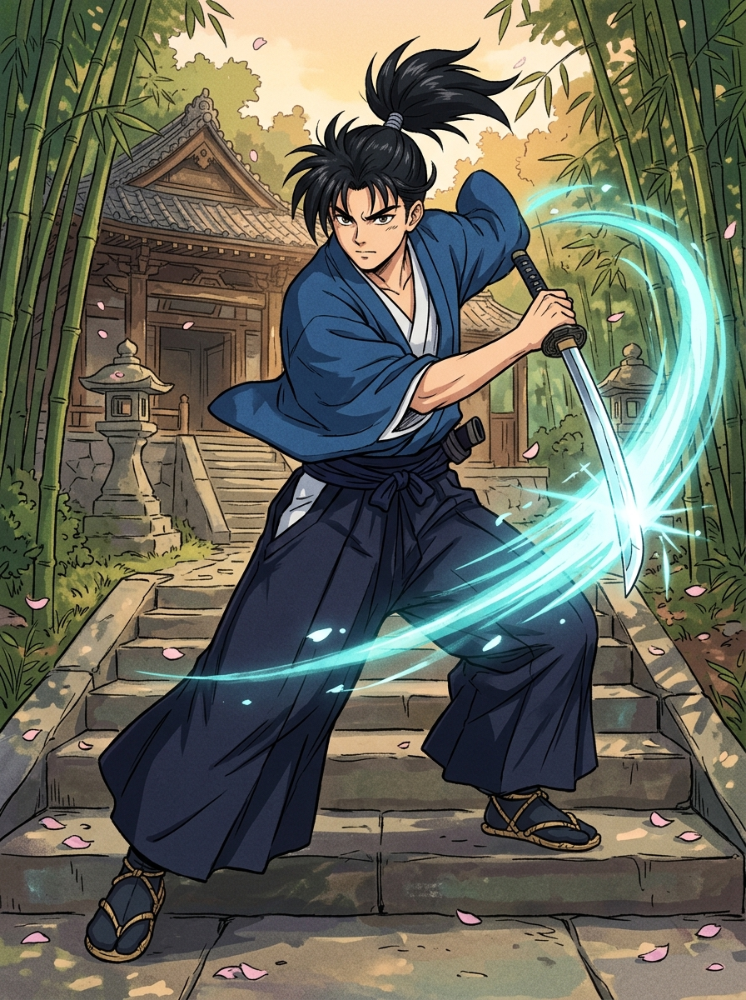
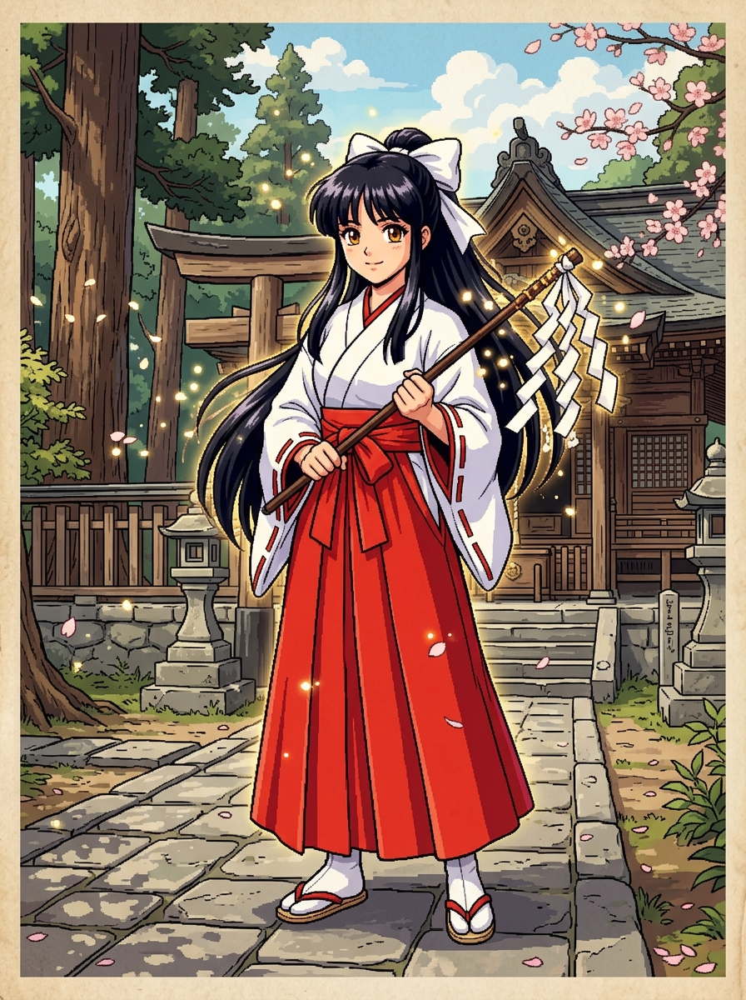
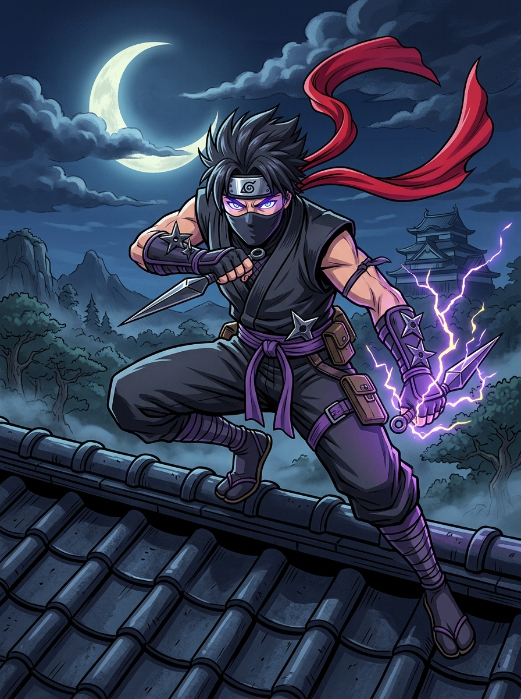
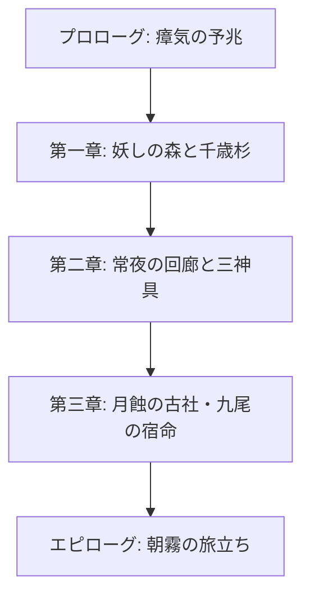

# 『妖幻奇譚 〜もののけ草子〜』世界観＆キャラクター設定資料集

---

## 🌸 プロローグ（物語の始まり）

神話と人の世が溶け合う古代の島国「葦原の国（あしはらのくに）」。
古来より人は八百万の神を敬い、妖怪（もののけ）たちとも不可侵の約定を結び、平穏な日々を紡いできた。

だが、百年に一度の「月蝕の年」。
冥府の闇を封じていた古代の結界「常夜（とこよ）の門」に亀裂が走る。
漏れ出した瘴気は山野を侵し、温厚だった森の精霊や付喪神（つくもがみ）たちを狂気へと狂わせた。

山間の静かな集落「神楽の里」。
そこへ、一人の若き流浪の侍・**疾風（はやて）**が流れ着く。
里を守る白鷺神社の巫女・**小夜（さよ）**、そして常夜の監視を担う月影の忍び・**朧（おぼろ）**と出会った時、運命の歯車が静かに、そして激しく回り始める——。

---

## 👥 仲間キャラクター設定（3名）

### 1. 疾風（はやて） - 侍 / 剛剣

- **職業**: 侍（流浪の若武者）
- **戦闘タイプ**: 前衛・物理高火力アタッカー / 高速抜刀術
- **代表技**: 『居合い一閃』『真空波』
- **背景**:
  名高き「風神無想流」の正統継承者。数年前に突如現れた謎の妖異によって一門を壊滅させられ、亡き師と仲間の無念を晴らすため、諸国を巡りながら剣の道を究めようとしている。ぶっきらぼうで寡黙だが、情に厚く、窮地の人を見捨てられない。

---

### 2. 小夜（さよ） - 巫女 / 神気・祈祷

- **職業**: 白鷺神社の巫女
- **戦闘タイプ**: 後衛・法術サポーター / 神気浄化＆回復
- **代表術**: 『神気治癒』『破魔の光』『火炎の符』
- **背景**:
  神楽の里の神木「千歳杉」に宿る神気を受け継ぐ巫女。幼い頃に両親を亡くし、神主の手で育てられた。実は、彼女の体内には**「人と大妖怪（狐神）のハーフ」**としての霊力が眠っている。その霊力ゆえに妖怪を引き寄せてしまう宿命に悩みながらも、人々を救うために健気に祈りを捧げ続ける。

---

### 3. 朧（おぼろ） - 忍（しのび） / 神速・雷遁

- **職業**: 忍（月影忍軍の若き頭領）
- **戦闘タイプ**: 中衛・超高速スピードアタッカー / 属性忍術・状態異常
- **代表技・忍術**: 『手裏剣乱舞』『雷遁の術』『影縫いの術』
- **背景**:
  代々、常夜の門の監視と封印の護衛を極秘裏に託されてきた「月影忍軍」の生き残り。冷徹な任務遂行を叩き込まれてきたが、情熱的な疾風と心優しい小夜に触れ、仲間としての信頼を深めていく。黒装束に赤いマフラーをたなびかせ、瞬速の身のこなしと雷遁の術で敵を翻弄する。

---

## 📜 メインストーリー構成（全3章）

### 【第一章: 妖しの森と千歳杉】（※プロトタイプ実装章）
- **あらすじ**:
  神楽の里で出会った疾風・小夜・朧の3人は、村長と神主の願いを受けて森を調査。暴徒化したから傘小僧や提灯お化けを退けながら森の最深部の古社へ。
- **クライマックス**:
  古社で妖狐の影と対峙。小夜の血筋と朧の忍び装束を見た妖狐は怨嗟の炎を燃え上がらせる。激闘の末、妖狐の影を退けるが、妖狐は常夜の門の完全開放を予告して消える。

### 【第二章: 常夜の回廊と三神具】
- **あらすじ**:
  常夜の門の封印を修復するため、3人は三神具（『八咫の鏡』『八尺瓊勾玉』『草薙の剣』）を求めて霊峰や湖底神殿へ向かう。朧の忍軍に伝わる抜け道や、疾風の剣技、小夜の祈りが合わさり数々の試練を乗り越える。

### 【第三章: 月蝕の古社・九尾の宿命】
- **あらすじ**:
  皆既月蝕の夜、紅く染まった月の下で「常夜の門」が開きかける。九本の黄金の尾を広げた大妖狐・茜が真の姿で降臨。
- **最終決戦**:
  疾風の剛剣、朧の雷遁、そして小夜の『天恵の浄化』が奇跡を起こす。妖狐の哀しみを受け止め、常夜の門を封印。妖狐は神木の守り神へと昇華する。

---

## ⛩️ ゲーム内用語集

| 用語 | 読み | 解説 |
|---|---|---|
| **葦原の国** | あしはらのくに | 物語の舞台となる豊かな自然に囲まれた神話的な島国。 |
| **常夜の門** | とこよのもん | 現世と死者の国（黄泉）を隔てる巨大な封印門。 |
| **千歳杉** | ちとせすぎ | 神楽の里の中心にそびえる樹齢千年の神木。結界の要。 |
| **月影忍軍** | つきかげにんぐん | 常夜の門の監視を極秘裏に務める忍びの一族。朧の出身組織。 |
| **神気** | しんき | 神聖な祈りや清らかな心から生まれる浄化の力。 |
