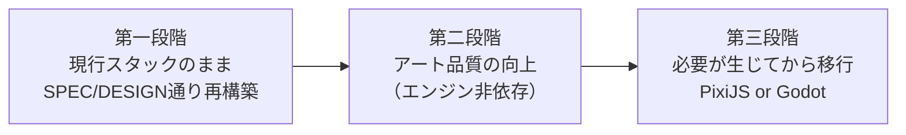

# 『妖幻奇譚 〜もののけ草子〜』技術選定書 v1.0

**作成日**: 2026-08-31
**作成**: Claude Code
**目的**: 「スマホで快適に動作する」を大前提に、Vanilla JS から「本格的なゲーム」へ移行する技術スタックの選定
**関連**: `SPEC_要件仕様書.md` / `DESIGN_技術設計書.md` / `code_review_report_claudecode.md`

> 本書は、開発チーム（Antigravity）から提示された3パターン提案（PixiJS/Phaser、Godot 4、Unity）に対する
> **事実検証**と、Claude Code としての**独自の推奨**をまとめたものである。

---

## 0. 結論（先に要点）

| 問い | 回答 |
|---|---|
| どのエンジンに移行すべきか | **今すぐ移行するなら PixiJS。ただし移行は第三段階に置くことを推奨** |
| 今すぐ移行すべきか | **いいえ**。現行の欠陥は1つもエンジン起因ではなく、移行しても全部ついてくる |
| スマホ性能は現行スタックの限界か | **いいえ**。1フレーム約313 drawImage は現代のスマホの限界に達していない |
| 「本格化」を阻んでいる真の要因 | **アート品質**（敵50種の多くが矩形2〜3個）。エンジンを変えても自動的には改善しない |

---

## 1. 提案内容の事実検証

### 1.1 訂正① Godot の「Web出力も対応」— 大前提と衝突する但し書きが欠落

**提案書の記述**: 「スマホ展開: iOS / Android 向けにボタン一つで最適化されたネイティブビルドが可能（Web出力も対応）」／比較表「スマホ適性 ◎」

**検証結果**: ネイティブビルドについては正しいが、**Web出力に重大な制約がある**。

- Godot 4 の Web 書き出しは当初 `SharedArrayBuffer` を必須とし、COOP/COEP ヘッダによる cross-origin isolation が要求された
- この結果、**ローカルの `index.html` 直開きは不可**。itch.io 等、ヘッダを設定できない第三者配信先でも動作しない
- 時期によっては macOS / iOS で上流バグにより Web 書き出しが動作しなかった
- Godot 4.3 でシングルスレッド書き出しが既定となり大幅に改善したが、**公式はモバイルブラウザ互換について「draw call と VRAM 使用量の削減が critical」と明言**しており、無条件の「◎」ではない

**評価**: 比較表の「スマホ適性 ◎」は**ネイティブアプリ限定なら正しく、ブラウザ配信を含めるなら過大評価**。
現行プロジェクトの最大の長所である「ファイルを開くだけで動く」（`review_request_claudecode.md` §4 の起動手順）は、Godot 移行時に失われる。

### 1.2 訂正② Unity の「注意点」が古い — ライセンス障壁はもう存在しない

**提案書の記述**: 「注意点: エディタの起動やビルドが重く、今回の『コードのみで即動く』シンプルさとは対極」

**検証結果**: 起動・ビルドの重さは正しい。ただし**費用面の最新状況が反映されていない**。

- 物議を醸した Runtime Fee は **2024年9月に完全撤回**され、2026年現在も復活していない
- Unity Personal は**年間収益・調達額 $200,000 未満まで無料**（Unity 6 リリース時の 2024年10月に $100k → $200k へ倍増）
- 有償版は $200,000 超から Unity Pro（年額 $2,200/席）が必要

**評価**: これは**Unity に有利な訂正**。本プロジェクト規模では実質無料であり、非推奨とするなら理由は費用ではなく「規模の不釣り合い」に置くべき。

### 1.3 訂正③ 「現在のコードの流用 ◎ ほぼそのまま移植可能」は約半分だけ正しい

**提案書の記述**: 比較表「現在のコードの流用: ◎（ほぼそのまま移植可能）」

**検証結果**: 実測により内訳を明らかにした（2026-08-31 時点）。

| 区分 | 該当箇所 | 行数 | 移植性 |
|---|---|---|---|
| **初期化時スプライト生成** | `graphics.js` 47〜2577行（`generateTiles`〜`generatePortraits`） | 2,531 | **ほぼ無傷で流用可** |
| **描画非依存のロジック・データ** | `data.js`(398) + `save.js`(135) + `audio.js`(388) | 921 | **100% 流用可** |
| 毎フレーム描画 | `graphics.js` 2578〜2804行（背景・漆枠・エフェクト13種） | 227 | 書き直し |
| シーン層 | `battle.js`(990) `map.js`(984) `main.js`(593) `opening.js`(186) `ending.js`(119) | 2,918 | `update()` と `render()` が同一クラスに同居、要分離 |
| **合計** | | **6,597** | **流用可 3,452行 = 52%** |

**評価**: 「◎」ではなく **「○」が妥当**。

ただし提案書が説明していない、**より強い論拠**が存在する。

> **PixiJS は `Texture.from(canvas)` により、生成済みの HTMLCanvasElement を直接テクスチャ化できる。**
> したがって最も労力のかかった **2,531行のスプライト生成コードが、1行も書き換えずに動く**。
> これがパターンA の本命の利点であり、提案書はこの理由に触れていない。

なお、**Godot / Unity でもこの資産は死なない**（提案書の「△ ロジック再構築」はアート資産について不当に低い評価）。

> 現行 JS を一度実行し、生成された全スプライト（タイル25 + 歩行24 + 戦闘12 + NPC9 + 敵50 + ボス9 + 立ち絵3 ≒ 107枚）を
> `canvas.toBlob()` で PNG 書き出しすれば、そのまま Godot / Unity にインポートできる。作業時間は1時間程度。

### 1.4 検証で問題が見つからなかった記述

以下は正確であり、そのまま採用してよい。

- PixiJS / Phaser 3 + Capacitor による iOS / Android ネイティブ出力
- PixiJS の WebGL / WebGPU 描画、シェーダー、パーティクル演出
- Godot 4 は MIT ライセンスで完全無料・ロイヤリティ不要
- Godot 4 の GUI エディタ（タイルマップ、アニメーション、UI配置）の充実
- Unity は商業 HD-2D（『オクトパストラベラー』等）の標準であり、アセットストアが巨大
- GDScript は Python に類似し学習コストは中程度

---

## 2. 提案書が問うていない前提

### 2.1 現行の欠陥は1つもエンジン起因ではない

3次にわたるコードレビュー（`code_review_report_claudecode.md`）で検出された主要欠陥:

| 識別子 | 欠陥 | エンジン起因か |
|---|---|---|
| C-1 | 戦闘結果（Lv/HP/EXP/習得技）が永続化されない | × 設計 |
| C-2 | 「どうぐ」コマンドがUIに未配線で操作不能 | × 配線漏れ |
| C-3/C-4 | セーブに章・ボス撃破・所持金が保存されない | × 設計 |
| R-1 | 全滅後HP=0のまま放置され即敗北ループ | × 設計 |
| R-4 | `useItemOnMap()` の呼び出し元が0件 | × 配線漏れ |
| B-1 | `skill.type` 無視で物理技が通常攻撃より弱い | × 計算式 |
| B-3 | 敵の `buffSpd` 欠落で行動順ソートが NaN | × 初期化漏れ |
| B-5 | 敵AIが `rate`（出現率）を無視 | × 実装 |
| B-11 | 戦闘進行が `setTimeout` 依存でスキップ不可 | × 設計 |

**9件すべてが設計・実装の問題であり、エンジンを変えても全部ついてくる。**

> **【2026-08-31 追記】修正状況の再検証**
> 本書初版の公開後、実コードを再確認したところ以下が判明した。
>
> | 識別子 | 状況 | 根拠 |
> |---|---|---|
> | R-4（マップ道具の配線） | **修正済** | `map.js:328`（タップ）と `map.js:488`（キー操作）から `useItemOnMap()` が呼ばれている |
> | B-9（アート品質） | **修正済** | §2.3 参照 |
> | **B-1（物理技の計算式）** | **未修正** | `skill.type` の参照が全ファイルで0件のまま |
> | **B-5（敵AIの rate 無視）** | **未修正** | `battle.js:532` が `actions[Math.floor(Math.random() * actions.length)]` のまま |
>
> 表の「エンジン起因か」の判定自体は変わらない（修正済のものも設計・実装の問題であった）。
むしろ移行中は「不具合の原因がエンジンか自分のコードか」の切り分けコストが増え、発見が遅れる。

### 2.2 描画性能は現時点でボトルネックではない

大前提「スマホで快適に動作する」に対する現状評価:

| シーン | 1フレームの描画呼び出し |
|---|---|
| MAP | タイル最大300（カリング済） + NPC最大10 + パーティ3 = **約313 drawImage** |
| BATTLE | 背景1 + 敵最大2 + 味方3 = 6、加えてテキスト20〜30 |

1280×960 で 313 回の `drawImage` は、**現代のスマートフォンの処理限界には全く達していない**。
WebGL 化による描画高速化は、現時点では解決すべき問題を解決しない。

実際のモバイル上のホットスポットは `DESIGN_技術設計書.md` §8.2 で特定済み:

1. `drawBattleBackground()` が毎フレーム `createLinearGradient` / `createRadialGradient` を生成
2. `canMoveTo()` が呼ばれるたびに `npcs.filter(npc => npc.chapter === ...)` を実行
3. `battle.render()` が毎フレーム `enemies.filter()` / `party.filter()` を複数回実行

**いずれも現行スタックのまま30分程度で解消できる。** エンジン移行は不要。

### 2.3 アート品質は改善済み — 残る制約はロジックと演出

> **【2026-08-31 訂正】** 初版では「敵50種の多くが矩形2〜3個で、アートが真の制約」と記述したが、
> `tools/export_sprites.html` による全スプライトの実出力検証の結果、**この記述は既に古い**ことが判明した。
> レビュー B-9 の指摘後に `graphics.js` が 1,281行 → 2,804行へ拡張され、アートは大幅に改善されている。

**現在の実測（2026-08-31、全スプライトを実際に描画して確認）**:

| 項目 | レビュー時（B-9指摘時） | 現在 |
|---|---|---|
| `graphics.js` 行数 | 1,281 | **2,804** |
| 生成スプライト（実体） | 約107 | **166**（登録キー197・エイリアス31含む） |
| 顔ポートレート | 3（主人公のみ） | **29**（ボス9体・NPC全員へ拡充） |
| 描画手法 | `createTile` + 矩形数個 | **`createOutlinedTile` + グラデーション・多角形・輪郭線** |

```js
// 現在の氷狼（hyouro）— 毛並みのグラデーション、尖った耳、牙、光る眼、爪、霜まで描き込まれている
this.sprites.hyouro = this.createOutlinedTile(s, (ctx) => {
  const g = ctx.createLinearGradient(0, 30, 0, 110);
  g.addColorStop(0, '#d8f0ff'); g.addColorStop(0.6, '#8ec8f0'); g.addColorStop(1, '#4888c0');
  ctx.fillStyle = g;
  ctx.beginPath();
  ctx.moveTo(20, 70); ctx.lineTo(44, 30); ctx.lineTo(84, 30); ctx.lineTo(108, 50);
  ctx.lineTo(116, 75); ctx.lineTo(96, 110); ctx.lineTo(30, 110); ctx.closePath(); ctx.fill();
  ctx.fillStyle = '#306898'; ctx.fillRect(36, 16, 14, 22); ctx.fillRect(72, 16, 14, 22);  // 耳
  ctx.fillStyle = '#ff3344'; ctx.fillRect(64, 44, 10, 6);  ctx.fillRect(88, 44, 10, 6);   // 光る眼
  // ...牙・爪・霜
}, '#0a0810', 3);
```

**この訂正が結論に与える影響**:

- 「アートが本格化の最大の制約」という前提は**もはや成立しない**
- したがって残る制約は **①ロジックの設計欠陥（§2.1）** と **②演出（エフェクト・アニメーション）の作り込み**
- ②は PixiJS のシェーダー・加算合成が効く領域であり、**移行の動機としては初版より強くなった**
- ただし①は依然としてエンジン非依存の問題であり、**三段階アプローチの結論は変わらない**（§3.1）

### 2.4 新規発見: スプライトが二重の命名体系で管理されている

全スプライト出力の検証過程で、**登録キー197個のうち31個が同一 canvas を指すエイリアス**であることが判明した。

```
boss_hyoka / hyoka          npc_village_head / npc_elder     npc_kannushi / npc_priest
boss_shuten / shuten        npc_smith_genzo / npc_smith      npc_taichi / npc_boy
boss_ibaraki / ibaraki      npc_merchant_jinbei / npc_merchant   … 計31件
```

日本語名ベースの新命名（`npc_village_head`）を追加した際、`data.js` 側の既存キー（`npc_elder`）を
書き換えずにエイリアスで対応した結果と見られる。**動作上の問題はないが、同じ絵に2つの名前が存在する状態**であり、
再構築時は片方へ統一すべき（`DESIGN_技術設計書.md` の `MASTER` データ設計に含めること）。

---

## 3. Claude Code としての推奨

### 3.1 三段階アプローチ



#### 第一段階: エンジンを変えずに、SPEC/DESIGN書どおり作り直す

- **目的**: 設計上の欠陥をエンジンごと持ち込まないこと
- **成果**: 「正しく動くゲーム」の確定。`DESIGN_技術設計書.md` §10 のマイルストーン1〜12
- **重要**: **移行するか否かの判断材料は、この段階を終えて初めて揃う**

#### 第二段階: アート品質の向上（エンジン非依存）

- 選択肢A: `DESIGN_技術設計書.md` §3.1 のパーツ合成方式でコード生成の質を上げる
- 選択肢B: 実際のドット絵素材を導入する（コード生成の制約から降りる）
- **ここが「本格化」の本体**

#### 第三段階: 必要が生じてから移行

この段階に至れば「何ができないから移行するのか」が明確になっている。

| 移行の動機 | 選ぶべきスタック |
|---|---|
| 加算合成の炎・雷、画面歪み、動的ライティング、シェーダー演出 | **PixiJS** |
| マップをGUIで作りたい、イベント・カットシーンを大量管理したい | **Godot 4** |
| App Store / Google Play での商業配信を主目的にする | PixiJS + Capacitor、または Godot |

### 3.2 今すぐ移行する場合の推奨: パターンA（TypeScript + PixiJS + Vite）

提案書と結論は一致するが、**論拠が異なる**。

| # | 推奨理由 | 提案書での言及 |
|---|---|---|
| 1 | 2,531行のスプライト生成が `Texture.from(canvas)` で無傷 | なし（本書で新規提示） |
| 2 | **`audio.js`（388行のWeb Audioシンセ）が100%そのまま動く** — Godot/Unityでは完全な書き直し | なし（本書で新規提示） |
| 3 | 「ファイルを開くだけで動く」に最も近い体験を保てる（Godot 4 Web はここが失われる） | なし |
| 4 | 大前提「スマホで快適」に対し、Web技術に留まるのが最も低リスク | 部分的 |
| 5 | `MASTER` / `GameState` の設計をそのまま活かせる | あり |

**移行時の必須条件**: 移行と同時にリファクタしないこと。
第一段階で正しく動くコードを作ってから移植する。**「移行しながら設計も直す」は、C-2/R-4 と同種の配線漏れを再発させる。**

### 3.3 Godot 4 を選ぶべき唯一の強い理由

表現力ではなく、**マップ制作**である。

現行のマップは 72×48 グリッドを座標のベタ書きで構築している:

```js
// map.js — 第一章マップの一部。これを全3章分、手で書いている
for (let x = 8; x <= 16; x++) { this.mapGrid[5][x] = 'roof'; this.collisionGrid[5][x] = true; ... }
for (let y = 22; y <= 26; y++) { for (let x = 5; x <= 10; x++) this.mapGrid[y][x] = 'field'; }
this.mapGrid[13][28] = 'torii_top'; this.mapGrid[14][28] = 'torii_post';
```

さらにボス出現判定が `p.gridX >= 33 && p.gridX <= 35 && p.gridY >= 39 && p.gridY <= 41` の形で
マップデータと独立にハードコードされており（レビュー B-12）、マップ調整時にズレるリスクを常に抱えている。

**第四章以降を大量に作るなら、GUIタイルマップエディタの価値は本物である。**
逆に言えば、マップ制作が苦痛でないなら Godot に移る動機は弱い。

### 3.4 Unity を推奨しない理由

- 本プロジェクトの規模（6,597行、1画面約313 drawImage）に対して**過剰**
- エディタ起動・ビルドの重さが、現行の「即座に試せる」開発サイクルを損なう
- **費用は障壁ではない**（§1.2 のとおり $200,000 未満まで無料）ため、非推奨の理由を費用に求めるのは誤り
- 将来、3D空間 + 2Dスプライトによる本格 HD-2D（被写界深度・ポストプロセス）を目指す段階になれば再検討に値する

---

## 4. 比較表（検証・補正済み）

提案書の比較表を、本書の検証結果で補正したもの。**太字が補正箇所**。

| 項目 | パターンA（PixiJS） | パターンB（Godot 4） | パターンC（Unity） |
|---|---|---|---|
| 向いている作風 | 軽快な2DレトロRPG / ブラウザ＆アプリ両対応 | 本格2D / HD-2D風伝奇RPG | 重厚なHD-2D / 商業水準 |
| スマホ適性（アプリ） | ◎ | ◎ | ◯ |
| **スマホ適性（ブラウザ）** | **◎** | **△ COOP/COEP制約・公式が最適化必須と明記** | **△ 容量大** |
| **「直開きで動く」の維持** | **◯ Viteビルドは要るがローカル配信可** | **× 不可** | **× 不可** |
| 開発環境 | VS Code / ブラウザ即時確認 | Godot専用軽量エディタ | Unity Editor（重量級） |
| **現在のコードの流用** | **○ 52%（スプライト生成2,531行＋音源388行は無傷）** | **△ ただしPNG書き出しでアートは救済可** | **△ 同左** |
| **音源(audio.js)の流用** | **◎ 100%** | **× 全面書き直し** | **× 全面書き直し** |
| マップ制作 | △ コード記述のまま | **◎ GUIタイルマップ** | ◎ |
| 学習コスト | 低 | 中 | 中〜高 |
| **費用** | **無料** | **無料（MIT）** | **$200k未満まで無料** |

---

## 5. 直近のアクション提案

> **【2026-08-31 更新】** 初版のアクション3（スプライト書き出し）は**実装・検証完了**（`tools/export_sprites.html`）。
> 初版アクション1のうち B-4 は既に修正済であることも判明したため、下表はその結果を反映した最新版である。

### 5.1 「ゼロから再構築する」方針を前提とした推奨順

| 順 | 作業 | 工数目安 | 判断 |
|---|---|---|---|
| **1** | **スプライトのアトラス書き出し**（`tools/export_sprites.html`） | **完了** | 再構築で唯一「捨てられない資産」を engine-agnostic に確保済み |
| **2** | **第一段階の再構築着手**（`DESIGN_技術設計書.md` §10 のマイルストーン1〜12） | — | 本命。移行判断の材料もここで揃う |
| — | B-1（物理技の計算式）/ B-5（敵AIのrate）の**現行コード修正** | 半日 | **省略推奨**（下記） |
| — | DESIGN §8.2 のホットスポット3件 | 30分 | **省略推奨**（下記） |

**「省略推奨」の理由**: ゼロから再構築する以上、現行コードへの修正は捨てられる。
これらの正しい挙動は既に `SPEC_要件仕様書.md` §6.2・§12 と `DESIGN_技術設計書.md` §4.4・§4.6・§8.2 に
**仕様として明文化済み**であり、再構築時に最初から正しく実装すれば足りる。

**例外**: 現行版を「比較用に遊べる状態」で残したい場合のみ、**B-1 だけは修正する価値がある**。
物理技が通常攻撃より弱いという不整合は、プレイ感を最も大きく歪めるため（Lv1疾風: 通常攻撃28 vs 居合い一閃20）。

### 5.2 スプライト書き出しツールの使い方

```bash
# プロジェクト直下でローカルサーバを起動（file:// では graphics.js が読めない）
python -m http.server 8080
# ブラウザで http://localhost:8080/tools/export_sprites.html を開く
```

| ボタン | 出力 | 用途 |
|---|---|---|
| アトラス PNG + JSON | `yougen_sprites.png`（2044×1392）+ `yougen_sprites.json` | **TexturePacker(JSON Hash)互換**。PixiJS は `Assets.load()` でそのまま読める。Godot / Unity もスライス設定に利用可 |
| 一覧シート PNG | `yougen_contactsheet.png` | 全166枚を名前付きで一覧。**アート品質の棚卸し用** |
| 個別 PNG 連続DL | 166ファイル | 個別に差し替えたい場合 |

エイリアス31件は実体を1枚に統合し、JSON側で全キーが同じ矩形を指すよう出力される。

---

## 付録: 検証に用いた出典

- [Web Export in 4.3 – Godot Engine](https://godotengine.org/article/progress-report-web-export-in-4-3/)
- [Web Platform Export – Godot docs](https://deepwiki.com/godotengine/godot-docs/7.4-web-platform-export)
- [Unity is Canceling the Runtime Fee – Unity Blog](https://unity.com/blog/unity-is-canceling-the-runtime-fee)
- [Unity Editor Software Terms Update: Runtime Fee Cancellation – Unity Blog](https://unity.com/blog/terms-update-runtime-fee-cancellation)
- [Unity Pricing Changes – Unity](https://unity.com/products/pricing-updates)

コード実測値は 2026-08-31 時点の `C:\dev\japanese-retro-rpg\js\*.js`（全6,597行）に基づく。
